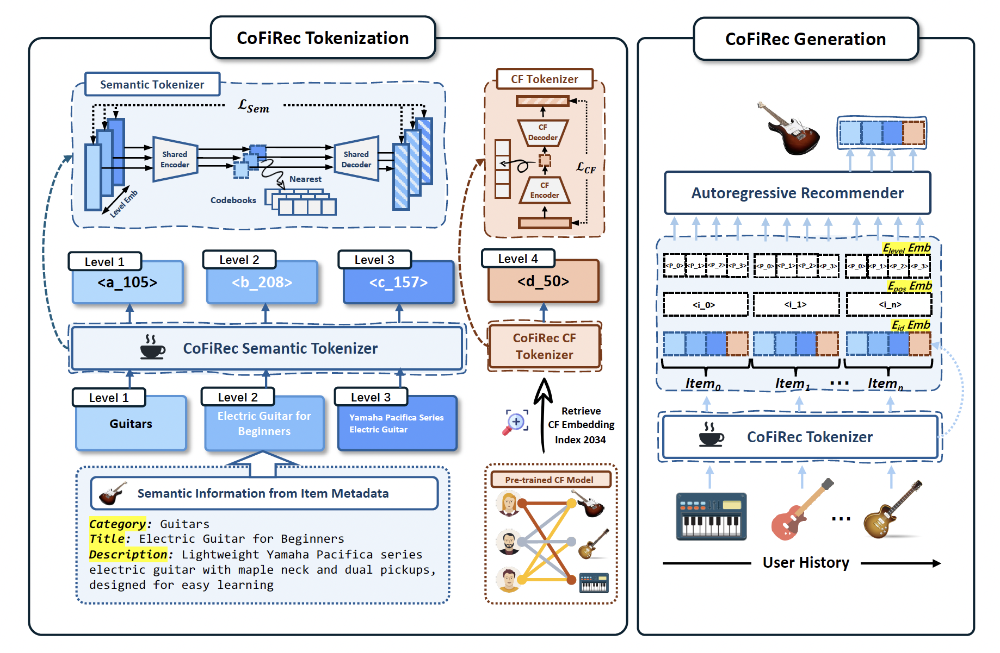

# CoFiRec: Coarse-to-Fine Tokenization for Generative Recommendationn

CoFiRec is a **coarse-to-fine generative recommendation framework** that aligns tokenization with how users naturally refine their preferences, from broad categories to specific items. Instead of flattening all item attributes into a single embedding, CoFiRec decomposes item semantics into multiple hierarchical levels and generates them progressively during decoding. This structured token design enables more controllable, interpretable, and effective recommendation performance.

Check out our full paper [here](https://arxiv.org/pdf/2511.22707).



---
## 📊 Data & Provided Files

We support **three public datasets**:

- Amazon Instruments  
- Amazon Beauty  
- Yelp  

We provide the following:

1. **Processed metadata** for each dataset, including user-item interaction sequences and item metadata required for constructing semantic hierarchies.
2. **Semantic embeddings** stored as `*.npy`, which are semantic embeddings for items' metadata. Download the full datasets from Google Drive [here](https://drive.google.com/drive/folders/1bCVHxBBRImkWQMYqB5XjbknK10gDqSwj?usp=sharing).  
Alternatively, you can generate the embeddings by running `data_process/amazon_vqvae.py`.
3. **Collaborative filtering embeddings** stored as `embedding.pt`.
4. **Index files** are tokenization indexes ready to use in the downstream generation.

Each item is represented by a sequence of **K = 4 tokens**:
- Level 1–3: semantic tokens (e.g., category, title, description)  
- Level 4: CF token  

---

## 🚀 Pipeline Overview

The overall pipeline consists of **two stages**:  
(1) tokenizer training and item tokenization, and  
(2) downstream generative recommendation training and evaluation.

## Requirements

```
torch
accelerate
bitsandbytes
deepspeed
evaluate
peft
sentencepiece
tqdm
transformers
```

## Stage 1 — Train Tokenizer & Tokenize Items

**Goal:** Train the CoFiRec Tokenizer and convert each item into a coarse-to-fine token sequence.

### Step 1: Train tokenizer
```bash
sh tokenizer/train_tokenizer.sh
```
This command trains the tokenizer and produces a tokenizer checkpoint (codebooks and encoder/decoder parameters).

## Step 2: Tokenize items with the trained tokenizer
```bash
sh tokenizer/tokenize.sh 
```

This step generates:

* item-to-token index mappings

* tokenized item representations used by downstream generation models

We also provide pre-generated index checkpoints for each dataset, so users can skip Stage 1 and directly proceed to Stage 2 if desired.


## Stage 2 — Downstream Generative Recommendation

Goal: Train an autoregressive generation model on the tokenized sequences and evaluate its performance.
```bash
cd generation
sh run_train.sh
```
This script trains the generative recommender using the tokenized item indices (either generated in Stage 1 or provided in the released checkpoints).

```bash
sh run_test.sh
```
This script loads the trained downstream model checkpoint and evaluates it on the test set.

---

### 📬 Contact
For questions, feel free to reach out to:  
**Xuying Ning** — `xuyingn2 [at] illinois.edu`
**Tianxin Wei** - `twei10 [at] illinois.edu`

---

⭐ If you find this work useful, please consider cite our paper!

```bibtex
@article{wei2025cofirec,
  title={CoFiRec: Coarse-to-Fine Tokenization for Generative Recommendation},
  author={Wei, Tianxin and Ning, Xuying and Chen, Xuxing and Qiu, Ruizhong and Hou, Yupeng and Xie, Yan and Yang, Shuang and Hua, Zhigang and He, Jingrui},
  journal={arXiv preprint arXiv:2511.22707},
  year={2025}
}
```
