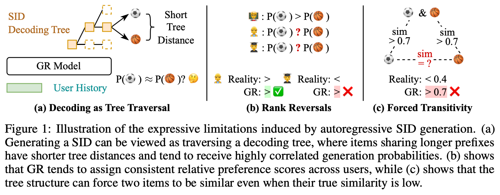

# Latte

Code for "[Expressiveness Limits of Autoregressive Semantic ID Generation in Generative Recommendation.](https://arxiv.org/abs/2605.06331)"

Generative recommendation (GR) models generate items by autoregressively producing a sequence of discrete tokens that jointly index the target item. However, this autoregressive generation process also induces a structured decoding space whose impact on model expressiveness remains underexplored. We show theoretically that GR models struggle to represent even simple patterns that can be well captured by conventional collaborative filtering models. To mitigate this issue, we propose Latte, a simple modification that injects a latent token before each semantic ID, improving expressiveness and yielding an average of 3.45% relative improvement on NDCG@10.

<div  align="center">

</div>

## Environment Setup

This project requires Python 3.12+. We recommend using [uv](https://github.com/astral-sh/uv) for fast and reliable dependency management.

### Installation with uv

```bash
# Install dependencies (automatically creates .venv)
uv sync
```

## Quick Start

Train a Latte model with default settings:

```bash
uv run bash train_latte.sh
```

Or with custom arguments:

```bash
# bash train_latte.sh [category] [gpu_id] [n_latent_tokens] [vq_method] [aggregation_method] [lr]
uv run bash train_latte.sh Industrial_and_Scientific 0 8 rqkmeans agg_max 3e-3
```

This script will:
1. Train a Latte model with the specified hyperparameters
2. Save the best checkpoint to `saved/`
3. Run inference with `num_beams=500` for final evaluation

## Usage

### Basic Command

```bash
uv run python main.py --model=<MODEL> --category=<CATEGORY> [OPTIONS]
```

### Models

- `Latte`: Our proposed method that adds latent tokens before semantic IDs
- `PSID`: Baseline model with purely semantic IDs (conflict-free)

## Categories

We use [Amazon Reviews 2023](https://amazon-reviews-2023.github.io/) for evaluation. The following categories are available: `Musical_Instruments`, `Industrial_and_Scientific`, and `Video_Games`.

### VQ Methods

Three vector quantization methods are supported for generating semantic IDs:

- `rqkmeans`: Residual Quantization with K-means (Faiss) - **supported by both PSID and Latte**
- `opq`: Optimized Product Quantization (Faiss) - PSID only
- `rqvae`: Residual Quantization with VAE (neural network) - PSID only

> **Note:** To use `opq` or `rqvae` with Latte, you must first train a PSID model with the same VQ method. Once PSID training starts (and has cached the semantic IDs), Latte can automatically load them.

### Example Commands

```bash
# Run Latte with default settings (rqkmeans)
uv run python main.py --model=Latte --category=Industrial_and_Scientific

# Run Latte with different VQ methods (requires PSID to cache semantic IDs first)
uv run python main.py --model=PSID --category=Industrial_and_Scientific --vq_method=opq   # cache semantic IDs
uv run python main.py --model=Latte --category=Industrial_and_Scientific --vq_method=opq  # then run Latte

# Run PSID baseline
uv run python main.py --model=PSID --category=Industrial_and_Scientific

# Run with custom configuration
uv run python main.py --model=Latte --category=Industrial_and_Scientific \
    --vq_method=rqkmeans \
    --aggregation_method=agg_max \
    --n_latent_tokens=8 \
    --lr=0.003

# Resume from checkpoint
uv run python main.py --model=Latte --category=Industrial_and_Scientific \
    --checkpoint=ckpt/your_checkpoint.pt
```

### Configuration

Configuration files are hierarchically loaded in the following order:
1. `genrec/default.yaml` - Default settings
2. `genrec/datasets/<DATASET>/config.yaml` - Dataset-specific settings
3. `genrec/models/<MODEL>/config.yaml` - Model-specific settings
4. Command-line arguments (override all above)

### Key Configuration Options

| Option | Description | Default |
|--------|-------------|---------|
| `--model` | Model name (Latte, PSID) | Latte |
| `--dataset` | Dataset name | AmazonReviews2023 |
| `--category` | Dataset category | Industrial_and_Scientific |
| `--vq_method` | VQ method (opq, rqkmeans, rqvae) | rqkmeans |
| `--vq_n_codebooks` | Number of codebooks | 3 |
| `--vq_codebook_size` | Size of each codebook | 256 |
| `--n_latent_tokens` | Number of latent tokens (Latte only) | 8 |
| `--lr` | Learning rate | 0.003 |
| `--num_beams` | Number of beams for beam search | 50 |
