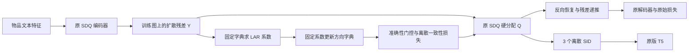

# 方向 5：LARS-SDQ——将稀疏方向学习转移到离散语义码本

这份方案把 `5.png` 中“内层 LARS 选方向与系数、外层更新字典”的思路，落实为 SDQ-VAE 的训练扩展。**核心研究问题是：在不增加 SID 长度与 T5 规模配置的前提下，稀疏方向学习能否改善最终的离散索引与推荐效果？** 代码和正式首轮实验已落地，效果仍需等待训练结果验证。

## 1. 对原始想法的判断

原图中最有价值的部分，是让相关码字共同解释一个物品，并在活跃方向集合中联合调整系数。相比每一步独立选一个码字，这提供了一种不同的字典学习信号。

但是，直接执行“稀疏编码 → 取方向编号 → SID”有四个问题：

1. **连续重构与离散表示不一致。** `2d₁+d₂` 和 `d₁+2d₂` 可以使用相同方向集合，连续重构依赖的幅度并未完整进入 SID。保留符号和排序也不等于保留全部系数。
2. **LARS 的入选顺序不保证推荐需要的粗到细结构。** 最大相关性首先解释的是当前几何残差，不一定是训练交互图上的低频公共语义。
3. **LARS、Lasso、OMP 不能混称。** LAR 沿等角方向联合移动；LARS-Lasso 还需要系数过零时退出活跃集；OMP 是另一种选支撑与最小二乘回拟机制。
4. **“稀疏编码生成 SID”已有近邻工作。** [Text2Tracks，§3 Learned](https://arxiv.org/html/2503.24193v1#S3) 使用单位向量字典、稀疏系数，并按系数绝对值排序，将带符号的方向编号串成 ID。因此不能把这个大概念本身作为首次提出的贡献。其任务是基于文本提示的音乐推荐，与这里的序列推荐不同，但技术重叠必须正面讨论。

因此，这次不把未经量化的连续系数当作推荐模型已经获得的信息，而是让**最终离散路径承担原始重构目标，稀疏路径为码本提供额外学习信号，并显式约束两条路径的一致性**。

## 2. 具体方法

暂定名：**RecLARS-SDQ（Recommendation-aware Trust-region LARS-SDQ）**。

方法名称虽然升级，但主体仍是图中的 LARS：内层固定方向字典选择活跃方向并联合求系数，外层固定系数更新字典。新增部分解决的是 LARS 连续目标与离散 SID/T5 目标之间的断层。

继承 SDQ 的编码器、3 个独立码本、图、扩散求解器、残差递推、解码器和全部原始损失。每个码本仍有 256 个 128 维码字。

第 ℓ 层的残差记为 Rℓ，扩散时间沿用 `tℓ = 2, 1, 0`：

\[
Y_\ell=P_{t_\ell}R_\ell,\quad
s_{i\ell}=\operatorname{Assign}_{SDQ}(y_{i\ell},C_\ell),\quad
Q_\ell=C_\ell[s_\ell],\quad
R_{\ell+1}=R_\ell-B_{t_\ell}Q_\ell.
\]

其中 `Assign` 完全复用现有 SDQ 实现，包括最后一层的 Sinkhorn。`P` 是前向扩散，`B` 是反向恢复，均沿用 DOPRI5。正式导出的 SID 仍然是 `(s₁,s₂,s₃)`。

### 2.1 内层：在固定方向字典上运行 LAR

对当前码本逐行归一化：

\[
D_\ell[j]=C_\ell[j]/\max(\|C_\ell[j]\|_2,\epsilon).
\]

保持原始码字的模长不变，只为辅助求解构造方向视图。对 `stop_gradient(Yℓ)` 与 `stop_gradient(Dℓ)` 运行预算为 3 步的 LAR 路径，得到稀疏系数 Aℓ，最多使用三个方向。系数可以为负。

活跃方向带上相关性符号后，记 Gram 矩阵为 G。等角方向由

\[
w=\frac{G^{-1}\mathbf1}{\sqrt{\mathbf1^T G^{-1}\mathbf1}},\quad u=D_{active}^{T}w
\]

得到，步长取下一个相关性相等的事件点，或者当前活跃集的最小二乘终点。每一步同时更新全部活跃系数。实现加 `10⁻⁷ I` 稳定 Gram 求解，并处理零向量、正负方向和共线字典。

**当前实现是预算截断的 LAR，不是精确 LARS-Lasso。** 它没有 Lasso 的系数退出事件，也不能写成“严格求解固定 λ 的全局 Lasso 最优解”。选择该版本是为了明确计算预算和活跃方向数量。其核心步骤已与 scikit-learn `lars_path(method="lar")` 的无退化参考问题对照。

### 2.2 外层：固定系数，更新码本

构造稀疏重构 `Uℓ=AℓDℓ`，增加：

\[
\mathcal L_{sparse}^{(\ell)}
=\frac1N\|A_\ell D_\ell-\operatorname{sg}(Y_\ell)\|_F^2.
\]

这里 A 停梯度，D 保留对码本的梯度。这是“固定内层编码、更新外层字典”的交替学习；与原图的外层优化精神一致，但使用现有 AdamW 做随机梯度更新，并不宣称每次求出字典子问题的精确解。

辅助目标的梯度不会通过目标 Y 回传给编码器，也不会通过 LAR 求解器回传。编码器仍由 SDQ 原始目标训练，避免编码器为迎合辅助求解而寻找简单的退化表示。

### 2.3 只从更准确的稀疏重构向离散码字转移

短 LAR 路径具有收缩效应，不保证每个样本都比最近码字更准确。真实数据的初始试跑也显示：最后一层的平均稀疏误差可能高于硬码字误差。因此设置无需新超参数的门控：

\[
g_{i\ell}=\mathbf1\{\|y_{i\ell}-u_{i\ell}\|^2
<\|y_{i\ell}-q_{i\ell}\|^2\},
\]

\[
\mathcal L_{bridge}^{(\ell)}
=\frac1N\sum_i g_{i\ell}
\|q_{i\ell}-\operatorname{sg}(u_{i\ell})\|_2^2.
\]

门控与教师目标都停梯度，这一项只更新被选中的硬码字。稀疏编码提供字典学习信号；当它比当前硬码字更准确时，再作为离散码字的参考。每个样本的门控只是局部几何判断，不保证图逆扩散后的误差或推荐指标一定提高。

总目标为：

\[
\mathcal L=\mathcal L_{SDQ}
+\rho(e)\frac13\sum_{\ell=1}^3
\left(\lambda_s\mathcal L_{sparse}^{(\ell)}
+\lambda_b\mathcal L_{bridge}^{(\ell)}\right),
\quad \rho(e)=\min(1,e/10).
\]

首轮统一采用 `λs=0.1, λb=0.1`，不按测试结果选择。所有损失均采用每个物品的平方误差和，再对物品平均，保持与 SDQ 原有 commitment 项的量纲一致。

### 2.4 信任域、分层稀疏预算与序列一致性

首轮暴露出一个关键风险：即使稀疏误差下降，后两层 SID 的条件熵也可能上升，T5 反而更难学习。因此正式候选方法加入三个互补约束。

1. **SDQ warm-start 信任域。** 从同配置 SDQ-VAE 最后一轮 `model.pt` 初始化，而不是让稀疏目标从随机初始化开始漂移。保存初始化码本方向 `C⁰`，增加归一化方向约束

   \[ \mathcal L_{anchor}=\frac{\lambda_a}{L}\sum_\ell
   \left\|\operatorname{norm}(C_\ell)-\operatorname{norm}(C^0_\ell)\right\|_F^2. \]

   同时读取该 checkpoint 导出的基线 SID。对每层 soft assignment `p_i^ℓ` 增加基线 code index 的交叉熵，使当前 SID 在没有足够证据时保持原路径；再加同权重的编码器参数锚定，防止码本不动而编码器跨越离散边界。这相当于以 SDQ 的可用 SID 为安全基线，只允许 LARS 在已有结构附近细化方向，避免新的离散词表整体漂移。

2. **粗到细预算。** 三个结构层使用 `3,2,1` 个 LAR 活跃方向，稀疏辅助权重使用 `1,0.5,0.25`。第一层保留表达能力，后两层只做小幅修正，针对 Toys/Sports 中细粒度长尾 token 的退化风险。

3. **转移感知软 SID 目标。** LARS 硬分配之外，暂时保留每层对 256 个码字的 soft assignment。对训练序列中相邻物品 `i→j`，令 `p_i^ℓ` 与 `p_j^ℓ` 的点积在当前 batch 的物品集合中最大：

   \[ \mathcal L_{seq}= -\frac1L\sum_\ell
   \log \frac{\exp((p_i^\ell\cdot p_j^\ell)/\tau)}
   {\sum_k\exp((p_i^\ell\cdot p_k^\ell)/\tau)}. \]

   该项把真实交互图的信息传给码本，同时不改变导出的硬 SID，也不把连续系数输入 T5。最终训练目标为 `LSDQ + ρ(e)(λsLsparse + λbLbridge + λaLanchor + λsidLsid + λseqLseq) + λdivLdiv`。

4. **全 SID 碰撞抑制。** 对语义特征相似度低于 0.2 的物品对，利用各层 soft assignment 点积的乘积近似“共享完整 SID”的概率，并对超过 0.05 的部分施加 hinge penalty。相邻且语义相近的物品不受该项限制，避免把真实共购关系错误拆开。这一项对应当前候选中碰撞率上升的风险。

这三个约束分别控制词表漂移、层级容量和推荐序列可预测性；它们不替换 LARS，也不把方法变成纯 Gumbel 或纯监督 tokenizer。



LAR 和连续系数只在量化器训练时使用。导出 SID 和 T5 推理时不需要它们，不增加每层输出的语义 token 数，也不把稀疏系数偷偷输入 T5。

## 3. 可以支撑的理论解释

**稀疏重构误差与离散差距需要同时控制。** 在固定图、精确线性扩散、对称归一化 Laplacian 的条件下，`Pₜ=e⁻ᵗᴸ`、`Bₜ=eᵗᴸ`，有

\[
\|R-B_tQ\|_F
=\|B_t(Y-Q)\|_F
\le e^{2t}\big(\|Y-U\|_F+\|U-Q\|_F\big).
\]

归一化 Laplacian 的谱上界为 2。该式说明：单独减小连续稀疏重构误差并不足以约束硬码字恢复误差，还需要处理连续到离散的差距。实际 DOPRI5 有数值误差，上式是理想算子的解释性上界；本实现的门控只对接受的样本优化 bridge 项，未接受样本继续依赖原始 SDQ 目标。因此不能把这个上界写成算法全局收敛保证。

**固定编码后的字典梯度存在码字耦合。** 忽略归一化映射的 Jacobian 时，稀疏目标对 D 的梯度含

\[
2 A^T(AD-Y)/N.
\]

一个样本可以对多个方向贡献梯度，`AᵀA` 可以存在非零交叉项。实际梯度还经过方向归一化的 Jacobian。需要强调：SDQ 本身已经通过图反向恢复带来码字耦合，不能把“首次使码字共同优化”当成新贡献；这里新增的是**由残差几何决定的稀疏方向耦合，以及与硬离散路径的联系**。

另外，普通 RQ 的贪心硬分配在当前方法中仍然存在，不能声称已经消除了贪心量化。前向图扩散的能量递减也不意味着任意训练结果的每层离散码字都严格满足单调能量层次。这些都需要诊断实验。

## 4. 与仓库实验配置对齐

使用现有 `SDQ-403` 的已完成实验 JSON 和原 YAML，而不是只参照论文超参数表。原论文采用 beam=20、五个种子 0–4；本地已运行基线采用 beam=30、seed=2025。首轮严格对齐后者。

| 项目 | 本次设置 |
|---|---|
| 数据 | 同一份 Amazon 2014 5-core Beauty / Sports / Toys |
| 划分 | 每用户按时间留最后两个交互作 valid/test |
| 输入检查 | canonical parquet 的 SHA256 与协议文件核对，freerec 三个划分逐行核对 |
| 文本特征 | 原有 `sentence-t5-xl_title_categories_brand.pkl`，不重新编码 |
| 图 | 原代码只用 train 的相邻物品构造二值无向图，加自环 |
| 图和量化训练历史 | 原代码 `maxlen=50`；这与 T5 的 maxlen=20 是不同环节 |
| 量化模型 | 原编码器/解码器，3×256 码本，128 维，DOPRI5，时间 2/1/0 |
| 量化优化 | 100 epoch，batch=256，AdamW，wd=0；Beauty/Toys lr=5e-4，Sports lr=1e-4 |
| 量化评估 | full graph，eval_freq=10，原 PPL 和碰撞率指标 |
| SID 导出 | 跟随现有脚本，使用第 100 轮导出的 SID |
| T5 | 原版 `SDQ-403/train_t5.py`，不复制修改 |
| T5 模型 | d_model=128，d_kv=64，d_ff=256，6 层 encoder/decoder，4 heads，dropout=0.1 |
| T5 训练 | 200 epoch，batch=512，lr=5e-4，AdamW，wd=1e-3 |
| T5 评估 | 原候选生成与过滤代码，beam=30，评估 batch=16，每 5 轮验证 |
| 最佳模型 | 按 valid NDCG@10 选 T5 checkpoint，再读取对应 test 结果 |
| 随机种子 | 2025 |
| 首轮新增项 | LAR steps=3，ridge=1e-7，λs=0.1，λb=0.1，10 轮线性升权 |

必须保留的口径说明：

- 现有 VAE 虽保存 `best.pt`，其 `sid_vocab.json` 实际来自最后一轮的导出。当前实验沿用这个流程，不能误写成“按最佳 PPL 选择 tokenizer”。
- `SemIDConverter` 检测到碰撞后会给所有物品追加校验 token。3 个语义 token 的预算相同，碰撞后的总长度、有效词表大小仍要报告；不能声称所有情况下都只有 3 个 token，或所有模型参数数目逐项完全相等。
- `ranking=full` 在这里沿用原 SDQ 的约束 beam 生成与打分接口，并非逐个计算全目录 item 的精确生成概率。它可直接比较同协议 SDQ；不能据此宣称与所有判别式全排序方法计算预算相同。
- 原运行环境实际是 FreeRec 0.9.7，脚本声明 1.0.1 并产生版本提示。本次复用已有环境，且实际数据训练及 T5 冒烟检查通过；没有为消除提示而升级依赖。

## 5. 首轮实验与证伪标准

| 实验 | 数据集 | 目的 | 状态 |
|---|---|---|---|
| 原 SDQ-VAE + T5 | 三个数据集 | 已完成的直接基线 | 读取现有结果 |
| LARS-SDQ main | Beauty / Sports / Toys | 验证完整方法 | 已启动 |
| LARS-SDQ no_bridge | Beauty | λb=0，保持其余配置相同 | 已启动 |
| control | 可指定数据集 | λs=λb=0，原 SDQ 等价对照 | 支持但未提交正式训练 |

当前唯一预先固定的主指标是验证集选择后的 **test NDCG@10**，同时报告 Hit/Recall、NDCG、MRR@5/10/20。

现有 SDQ 的精确 test NDCG@10 来自 `best.pkl['best']`：Beauty **0.04107275**，Sports **0.02665110**，Toys **0.03889344**。`best.pkl['test']` 是不同时间点的数据，不能混用。

必须先回答以下问题，再讨论论文结论：

1. main 是否在三个数据集上改善推荐指标，而不仅是连续 sparse MSE？
2. main 是否优于 no_bridge？若没有，核心的连续到离散转移论点缺乏支持。
3. 如果 sparse MSE 下降，但硬码字误差、碰撞率或推荐指标变差，说明辅助字典目标可能与最终索引任务冲突。
4. 教师接受率是否足够，是否只有第一层在获益？若最后一层始终拒绝，则应考虑分层适用性，而不是宣称全层机制一致有效。
5. 训练时间、有效词表、校验 token 数是否显著增加？收益需要与成本一起报告。

首轮每个数据集只有一个种子，**只能作为可行性实验，不能证明统计显著性或训练稳定性**。若首轮支持假设，再让 baseline/main 配对运行 2025/2026/2027，报告均值与标准差；需要按用户配对 bootstrap 时，再导出逐用户预测。不能把用户 bootstrap 替代跨训练种子的稳定性分析。

### 5.1 Toys 退化的已完成诊断

首轮结果：Beauty `0.042504`（SDQ `0.041073`），Toys `0.037975`（SDQ `0.038893`）。Toys 的量化重构几乎没有改善（SDQ `0.5405`，LARS `0.5415`），而 commitment 项上升（`0.7427 → 0.7646`）。SID 碰撞率只从 `0.2009` 降到 `0.1988`，因此“碰撞更少”没有转化为推荐收益。

更有区分度的是码本利用和时序可预测性：Toys 的第二层 PPL 从 `209.20` 升到 `210.25`，相邻交互的第二层条件熵从 `6.434` 升到 `6.442`；第一层和第三层的变化很小。Toys 的后两层是更细的区分码，稀疏交互下对 T5 更容易变成难学习的长尾 token。LARS 的第三层教师接受率约为 `0.55`，但原实现仍让所有样本的 `sparse_loss` 更新方向字典；桥接项的门控没有阻止被拒绝样本改变字典。这解释了为什么 Beauty 可以受益，而 Toys 可能被细粒度码破坏。现有结果还不能证明是 T5 随机波动，因为 Toys 的最佳验证 NDCG@10 也低于 SDQ（`0.0528` 对 `0.0537`）。

第二轮 **margin-gated LARS-SDQ** 已完成 Toys：当且仅当

\[
\|Y-U\|^2 < 0.9\|Y-Q\|^2
\]

时，才让该样本更新稀疏字典和硬码字；拒绝样本完全使用原 SDQ 的码本目标。这是一个以 SDQ 为安全下限的信赖机制，不是用测试集筛选阈值。Toys 的 test NDCG@10 为 `0.037897`，仍低于 SDQ `0.038893`，因此该门控被判定为不足。

当前正式候选是 **RecLARS-SDQ trust_region**：从 SDQ 最后一轮 `model.pt` warm-start，增加编码器与码本方向锚定、基线 SID 交叉熵、`3/2/1` 分层 LAR 预算，以及序列转移 soft SID 目标。Toys 正在进行 100 轮 VAE；第 10 轮 PPL `208.191`，低于 SDQ `212.773`，但碰撞率升至 `0.2302`，最终结论必须等原版 200 轮 T5 的验证选择结果。该版本是否达到推荐提升不能由 VAE PPL 代替。

下一步有价值但尚未实现/运行的消融：用同预算 OMP 或 top-correlation 教师替换 LAR，判断等角路径是否真的有必要；去掉门控；steps=1/2/3/4；只在前两层用稀疏目标；有/无图扩散；方向归一化对照。不要把这些尚未完成的实验写入结果表。

## 6. 代码、检查与查看结果

代码目录：`/data/fszhang/RecBoard-master/SDQ-LARS`。原 `SDQ-403` 的源代码、配置和已有模型未改写。

主要文件：

- `lars_solver.py`：批量 LAR 求解器。
- `lars_quantizer.py`：训练用稀疏目标、准确性门控和离散一致性约束。
- `train_lars_vae.py`：基于原 VAE 训练脚本作最小扩展，支持分层预算、SDQ warm-start、码本/编码器/SID 信任域和转移感知 soft SID 目标，并记录各层诊断。
- `audit.py`：数据指纹和实际运行配置核对，不一致时阻止继续。
- `run_experiment.py`：量化 → SID 检查 → 原 T5 → 最佳验证 checkpoint 对应测试结果。
- `launch.py` / `status.py`：后台启动和结果汇总。
- `test_lars.py`：参考数值、共线/零输入、梯度路径和零权重退化检查。

RecLARS-SDQ 的正式启动方式仍复用原配置与 T5：

```bash
python run_experiment.py --dataset Toys --variant trust_region --gpu 3 --run-name 20260923_trust
```

该变体使用原 SDQ 最后一轮 `model.pt` 和 `sid_vocab.json` 作信任域基线；`best.pt` 不作为初始化，以免改变已有 T5 对照的 SID 口径。

已经通过：LAR 与 sklearn 参考对照；5 个数值/梯度测试；三数据集的划分一致性审计；真实 Beauty 一轮 VAE；真实 T5 的 batch=512 反传、16×30 beam 候选和全部 12,101 个物品的 SID 往返检查。冒烟训练使用 1 轮，并与 100+200 轮正式实验隔离；不作为推荐效果结果。

```bash
cd /data/fszhang/RecBoard-master/SDQ-LARS
/data/fszhang/anaconda/envs/myenv_t5/bin/python status.py --run-name 20260922_r1
```

正式输出：`runs/20260922_r1/{main,no_bridge}/{Beauty,Sports,Toys}/`（只包含实际提交的组合）。各目录保存 `status.json`、输入审计、实际命令、阶段日志、配置审计，完成后写入 `result.json`。完整模型在 `SDQ-LARS/logs/LARS-20260922_r1-*`。

## 7. 文献定位与可写的贡献

参考基础：

- [Efron et al., Least Angle Regression, 2004](https://arxiv.org/abs/math/0406456)：等角路径与 Lasso 修改版的来源；本工作不把优化器本身作为创新。
- [Mairal et al., Online Dictionary Learning for Sparse Coding, 2009](https://www.di.ens.fr/~fbach/mairal_icml09.pdf)：交替稀疏编码与字典学习的相关基础。
- [Text2Tracks, 2025](https://arxiv.org/html/2503.24193v1)：稀疏方向编号形成 SID 的直接技术近邻。
- [DIGER, 2026](https://arxiv.org/abs/2601.19711)：指出 tokenizer 独立训练造成 indexing/recommendation objective mismatch，并用带退火的 Gumbel 探索让推荐梯度进入 SID；这里借鉴“离散目标必须可感知”的问题诊断，但保留 LARS 的交替字典学习和 SDQ 硬路径。
- [HiD-VAE, 2025](https://arxiv.org/abs/2508.04618)：用层级监督和 uniqueness loss 减少 SID 碰撞；这里不引入额外标签，而用基线 SID 锚定和序列转移目标处理同一个离散稳定性问题。
- [scikit-learn lars_path](https://scikit-learn.org/stable/modules/generated/sklearn.linear_model.lars_path.html)：数值实现参考。
- 用户提供的 `403_Structure_Diffusion_Quanti.pdf`，重点对应 §3.1–3.4、§4、附录 A 与 C：图扩散、码本耦合、实验设置和边界。

**当前能提出的贡献候选**：揭示“连续稀疏重构质量不等于离散 SID 质量”的实现与目标差距；在 SDQ 的结构分层空间中学习稀疏方向关系；通过停止梯度和可靠性门控把学习信号转移到固定预算的硬码字上。

这仍然是有明确机制和证伪路线的研究假设。有限检索不能保证没有更近的工作，尚不能给出“足够顶会创新”或“必然超越 SDQ”的判断。尤其需要 OMP/top-correlation 对照来证明 LAR 的特有价值，否则论文应围绕稀疏辅助字典学习展开，而不是过度强调 LARS 名称。
