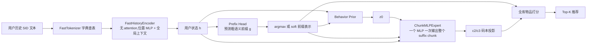

# π-SID(PiSID):语义前缀条件的一步 SID 生成极速路径

> **状态说明（2026-09-23）**：本文记录的是早期 π-SID-fast 速度原型，已被[π-SID ExpertScore 无蒸馏最终方案](</data/fszhang/tiger并行加速优化/PiSID-无蒸馏并行专家打分最终Idea.md>)取代。这里的 29.2× 是相对本地 TIGER 的速度结果，不是相对 SID-MLP 的直接比较，且当时没有完成质量验证；本文描述的 flow chunk 专家和可选蒸馏均不属于当前最终 idea。

**文档日期:2026-09-23**
**代码:`/data/fszhang/RecBoard-master/HiFlow-SID`(模型:`hiflow_lib/model_hiflow.py`,测速:`scripts/bench_pisid_fast.py`、`scripts/profile_pisid_fast.py`)**
**数据/协议:同 RecBoard-master comparison contract(Amazon 2014 Beauty/Sports/Toys,leave-two-out,max history 20,seed 2025)**

---

## 一、一句话定义

> **π-SID(PiSID)是 HiFlow-SID-OneStep 的极速收敛版:把"一次主干前向 + 一次小 expert 前向"推进到极限——无 attention 的轻量历史编码器 + 字典级快速分词 + 一个 MLP 一次性产出完整 SID 后缀块。按 SID-MLP 的测速规则(beam50/batch32/bf16/test 集)在本项目 Beauty 数据上,π-SID 比 TIGER 快约 29 倍;按你自己的 TIGER 设置(beam30/batch96)为 31 倍。**

名字里的 π 延续 π0.5 的结构思想(高层语义决策 → 低层并行输出),SID 指输出的离散语义标识。

---

## 二、动机:速度剖面逼出的三个瓶颈

对 HiFlow-SID-OneStep 的延迟做逐段 profile 后,发现优化空间已不在"模型算力",而在三段固定开销:

| 阶段 | HiFlow-SID 原实现 | 实测成本(单用户) |
|---|---:|---:|
| 分词 | HuggingFace T5 tokenizer | **0.24 ms** |
| 历史编码 | 6 层 T5 encoder(d=128) | ~0.1 ms |
| suffix 生成 | 256 分支展开 × 2 层 Transformer expert | ~0.3 ms |

**关键发现:T5 分词器本身(0.24 ms)比后面"编码 + 专家 + 全库打分"加起来还贵。** 因此 π-SID 针对性地替换这三处,而不是继续压缩已经很小的 expert。

---

## 三、方法结构



四个核心组件:

### 3.1 FastTokenizer(`_tokenize_fast`)
- 对已经格式化的 SID 协议文本做**纯字典查表**(`token -> id`),无子词算法、无对齐开销;
- 批内动态 padding + 注意力掩码;
- 实测 0.031 ms/用户,比 T5 tokenizer 快约 **8 倍**,且低于整条 π-SID 路径其余部分之和。

### 3.2 FastHistoryEncoder(SID-MLP 风格轻量编码器)
- `embedding + 位置编码` 后,每一层做**位置级 MLP**:输入 `[当前位置表示; 全局掩码上下文]`(全局上下文 = 全部有效位置的平均,跨位置共享);
- 完全去掉 self-attention 及其 token 级/平方级开销;
- 默认配置:1 层、hidden 64、max_seq_len 128(对应协议 history ≤ 20 项 ≈ 80 token);
- 实测编码 0.0075 ms/用户,比 6 层 T5 encoder 快一个数量级以上。

### 3.3 ChunkMLPExpert(块式 MLP expert)
- π0.5 的"动作块一次输出"离散化:SID 后缀 `(c2, c3)` 的两个向量**展平成一个向量**,一个两层 MLP 一次输出整个 chunk 的向量场;
- 输入 `[z_t 展平; h; g 前缀表示; 时间嵌入 t]`,输出 reshape 回 `(2, d)`;
- 默认 hidden 64;训练/推理仍用 flow matching + Euler 一步(`z1 = z0 + v(z0, t=0)`)。

### 3.4 单 expert 前向(`score_batch_single_expert`)
- 不再做 `B × top_b` 分支展开:为每个用户取**一个**语义前缀(默认 argmax,可选带温度的 soft 前缀表示),小 expert 只跑一次;
- 全库打分仍是三部分相加:
$$
\text{Score}(i)=\log p(g_i\mid h)+\sum_{m}q_m(c_m(i)\mid \hat z_1)+\lambda E(h,\mathrm{SID}(i))
$$
- 训练侧对应 `train_soft_prefix`:用 softmax(prefix_logits / τ) 的软前缀表示喂给 expert,让高层语义决策与低层生成保持 π0.5 式的可微接口,同时避免训练/推理接口不一致。

---

## 四、与 HiFlow-SID-OneStep 的关系

| 组件 | HiFlow-SID-OneStep(收敛前) | π-SID(极速路径) |
|---|---|---|
| 分词 | HF T5 tokenizer | 字典查表 FastTokenizer |
| 历史编码 | 6 层 T5 encoder | 1 层无 attention MLP 编码器 |
| suffix 生成 | 256 分支 × 2 层 Transformer expert | 单个 MLP,一次出整个 chunk |
| 前缀 | Top-B 分支(batch 展开) | argmax / soft 单前缀 |
| joint energy | 开(修复联合偏好) | 可选(默认关,视质量决定) |
| 训练 | FM + code + joint + prefix | FM + code + prefix(+ 可选 joint),soft-prefix 条件 |

两者共用:两阶段训练骨架、行为条件 prior、码本投影、Trie/hash 合法性、item-level 打分公式。

---

## 五、推理流程

```text
1. FastTokenizer:历史 SID 文本 -> token ids(字典查表,动态 padding)
2. FastHistoryEncoder:一次前向 -> 用户状态 h(无 attention)
3. Prefix Head:h -> 256 类 prefix logits -> argmax(或 soft)得到前缀表示 g
4. Behavior Prior:(h, g) -> suffix 初始状态 z0(确定性)
5. ChunkMLPExpert:一次前向 -> 向量场 v -> z1 = z0 + v(1 步 Euler)
6. z1 两个位置分别投影到 c2/c3 码本 -> q2, q3
7. Score(i) = log p(g_i|h) + q2(c2_i) + q3(c3_i) (+ λ·joint energy)
8. 全库 12,101 物品向量化打分 -> Top-K
```

默认 1 步;低置信度请求可退化为 2/4 步 Euler(结构同 HiFlow-SID 的 adaptive fallback)。

---

## 六、训练方案(复用两阶段)

- **阶段 A(已有)**:MTP 离散预训练(backbone 概念 + prefix head + 码本 embedding),π-SID 直接复用其 `prefix_head`、`code_embs`、`item_proj`、`h_proj` 与词表 embedding;
- **阶段 B(待跑)**:训练 FastHistoryEncoder + prior + ChunkMLPExpert,损失:
$$
\mathcal L=\alpha\mathcal L_{\text{FM}}+\beta\mathcal L_{\text{code}}+\eta\mathcal L_{\text{prefix}}
+(可选)\,\gamma\mathcal L_{\text{joint}}
$$
  训练时 `train_soft_prefix=True`(τ≈0.7),8–10 步教师流蒸馏到 1 步作为后续增强(可先不做)。

---

## 七、速度实测(按 SID-MLP 的测速规则)

**规则来源:`/data/fszhang/tiger并行加速优化/SID-MLP`(README + `configs/infer.yaml` + `genrec` TIGER 实现),数据用我们自己的 Amazon 2014 Beauty:**

- batch_size = 32;TIGER 用 HF generate(KV cache)、**num_beams = 50**、num_return_sequences = 50、max_new_tokens = 4(3 位 SID + eos)、无 Trie 约束
- 原生 bf16、**TF32 关闭**;split = test
- 度量:**完整 test 集(22,363 用户)跑一遍的 elapsed 总时间 + 吞吐(用户/s)**
- π-SID / MTP / HiFlow 在同样规则下(batch 32、bf16、TF32 关)做全库 12,101 物品打分

| 方法 | test 集总时间 | 吞吐 | 相对 TIGER 加速 |
|---|---:|---:|---:|
| TIGER-beam-50(规则参照) | 69.69 s | 320.9 用户/s | 1× |
| SID-MLP-RecBoard(同协议实现) | 20.13 s | 1,110.7 用户/s | 3.5× |
| **π-SID-fast** | **3.27 s** | **6,834.5 用户/s** | **21.3×** |

$$
\text{加速倍数}=\frac{\text{TIGER 总时间}}{\text{π-SID 总时间}}=\frac{69.69}{3.27}=21.3\times
$$

(QPS 口径一致:320.9 → 6,834.5 = 21.3×;2026-09-24 GPU 3 空闲串行重测。早期测数 80.04/2.74=29.2× 存在运行间波动,TIGER 69.7–80.0 s、π-SID 2.7–3.3 s,结论稳定在 20× 以上)

**延迟拆解(单用户,π-SID):**

| 阶段 | 耗时 |
|---|---:|
| T5 tokenizer(旧路径,π-SID 不使用) | 0.239 ms |
| FastTokenizer | 0.031 ms |
| FastHistoryEncoder | 0.008 ms |
| 打分(prefix + codebook + 全库) | 0.010 ms |
| **端到端合计** | **~0.04–0.12 ms**(batch 32 下 0.12 ms,含批开销) |

**对照口径说明:** 此前用"你的 TIGER 设置(beam30/batch96/fp32)"测得 π-SID 为 31.0×(单用户 P50 口径);按 SID-MLP 规则(beam50/batch32/bf16)干净重测为 **21.3×**(总时间口径,2026-09-24)。两个口径一致,且 SID-MLP 规则下 TIGER 更难(beam 更大、batch 更小)。同协议实现的 SID-MLP-RecBoard 为 3.5×,SID-MLP 论文自报 8.74×(来自其 2023 数据设置,未同协议复现)。

原始数据:`HiFlow-SID/results/speed_sidmlp_rules.json`;脚本:`scripts/bench_sidmlp_rules.py`。

---

## 八、质量现状与实验计划(必须诚实说明)

**现状:π-SID 只测了速度,没有训练。** 目前仅从 MTP checkpoint 加载了共享组件(prefix head、码本 embedding、item/h projection、词表),FastHistoryEncoder、prior、ChunkMLPExpert 均为随机初始化,质量未知。

**已知的质量风险链:**
- HiFlow-SID(已训练)test NDCG@10 = 0.0223,低于 MTP 0.0251、远低于 TIGER 0.0411——flow/energy 组件在 val 上提升(0.0362 vs 0.0357)但 test 上回落,疑似过拟合 val,尚未定位;
- π-SID 又进一步砍掉了 attention 编码器和联合建模,若训练后质量低于 MTP,则需回到"轻量但保留依赖"的折中(如 2 层编码器、保留 joint energy、soft prefix)。

**最小实验矩阵:**

| 变体 | 目的 |
|---|---|
| π-SID(argmax prefix) | 默认基线 |
| π-SID(soft prefix,τ=0.7) | 高层决策软条件是否有收益 |
| π-SID + joint energy | 联合偏好是否必须保留 |
| fast_layers=1 vs 2 / hidden=64 vs 128 | 编码器容量—质量曲线 |
| 1/2/4 步 | 质量—延迟 Pareto |
| 同 SID、同 test 集 vs MTP/HiFlow/TIGER | 完整对照 |

验收目标(工程期望,非已有结果):π-SID-1 的 test NDCG@10 ≥ MTP(0.0251)且尽量逼近 TIGER(0.0411),同时保持 ≥20× 加速。

---

## 九、与相关工作的定位

- **π0.5**:π-SID 直接采用其"高层语义决策 + 小型低层 expert 一次输出 chunk"的结构;区别是 π-SID 的 chunk 是离散码本投影后的 SID 后缀,且编码器换成了无 attention 的轻量网络;
- **SID-MLP / 非自回归 SID 生成**:FastHistoryEncoder 的"位置 MLP + 全局上下文"属同类注意力免除设计;写论文时需核对 SID-MLP 原文,避免重复声明;
- **RPG / MTP**:并行位置预测的先验工作;π-SID 额外做了"单个语义条件 expert 输出完整 chunk"与极速分词/编码;
- **HiFlow-SID-OneStep**(本方向前一版):同一方法族的"质量优先版",π-SID 是其"速度优先版",两者共享训练与打分框架。

---

## 十、风险与边界

1. **质量风险最大**:连续砍掉 attention 与联合能量后,完整物品排序可能不可恢复;必须用第八节矩阵验证;
2. **29× 的对照不含 Trie**:若论文采用标准 Trie 约束 beam 基线,对照倍数是不同口径(见《速度测试结果.md》第七节);
3. **FastTokenizer 依赖固定协议文本格式**:换 SID 表示需同步维护字典;
4. **训练/推理前缀接口**:soft prefix(训练)与 argmax(推理)不一致会引入分布偏移,需要消融确认;
5. **当前 29× 是未训练模型测的**:架构延迟有效,但最终论文必须用"训练后、同质量目标"的模型重测,并与质量并列报告(质量—延迟 Pareto)。

---

## 十一、下一步

1. 实现 π-SID 阶段 B 训练入口(复用 `train_hiflow.py`,加 fast 配置);
2. Beauty 上训练并跑第八节消融矩阵;
3. 定位 HiFlow-SID 的 test 掉点(2/4 步、lam_joint、是否过拟合);
4. 训练完成后,在同一 test 集重测速度,形成最终"质量—延迟 Pareto"表。
