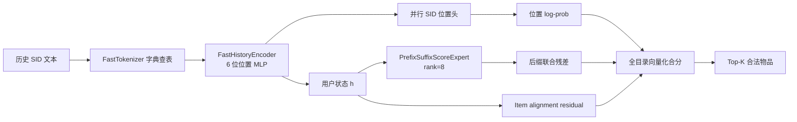

# π-SID ExpertScore v3 方法说明

更新日期：2026-09-24  
实现目录：`/data/fszhang/RecBoard-master/HiFlow-SID`  
当前 checkpoint：`logs/HiFlow-SID/Amazon2014Beauty_550_LOU/pisid-expertscore-distill-pos6-r8-v3/best.pt`

## 1. 方法概述

π-SID ExpertScore v3 是一个面向 Semantic ID 推荐的并行全目录排序模型。它把 TIGER 的逐 token 自回归生成改成一次用户编码、一次并行位置预测和一次全目录矩阵打分。

每个物品的 Semantic ID 写成三位码：

\[
\operatorname{SID}(i)=(c_1^i,c_2^i,c_3^i),
\]

其中 `c1` 是粗粒度语义前缀，`c2,c3` 是细粒度后缀。模型保留三个位置的独立 SID 概率作为稳定的基础排序，再用一个很小的低秩专家建模“用户状态 + 粗语义前缀”条件下的后缀联合偏好。

在线服务路径不运行 T5、beam search、逐 token 解码、flow matching 或多步 Euler 积分。T5/MTP 只在训练阶段作为快速编码器的表征教师使用。

## 2. 设计来源与改写

方法借鉴了 `2504.16054v1.pdf` 中 π0.5 的层级分工：先预测高层语义，再由专门的小 expert 产生条件化的低层输出块。π0.5 原文的低层输出是连续机器人动作，并通过 flow matching 生成动作块；这里将高层 subtask 改成 SID 粗前缀，将低层 action chunk 改成 SID 后缀联合分数。

对应关系如下：

| π0.5 | π-SID ExpertScore |
|---|---|
| 高层 semantic subtask | 粗 SID 前缀 `c1` |
| 低层 action expert | prefix-conditioned suffix score expert |
| 动作块 flow matching | 目录物品后缀联合重打分 |
| 自回归文本/动作输出 | 并行 SID 位置头 + 全目录排序 |

SID-MLP++ 提供了第二个实现启发：使用位置 MLP 和全局上下文替换 self-attention。v3 采用了同类快速编码器，但增加了 prefix-conditioned 低秩联合项和 item-level alignment residual。

## 3. 在线模型结构



### 3.1 固定协议与快速分词

历史由固定格式的 SID 文本组成，例如：

```text
<SID> <sid_0_30> <sid_1_185> <sid_2_151> <sid_c_0> </SID>
```

`FastTokenizer` 直接按空格切分，再通过 token 到 id 的字典查表。它保留动态 padding 和 attention mask，但省去通用 T5 tokenizer 的子词处理和对齐开销。

### 3.2 FastHistoryEncoder

输入 token embedding 与绝对位置 embedding 相加。每层先计算有效 token 的 masked mean 作为全局上下文，再将当前位置表示和全局上下文拼接，送入位置专用 MLP：

\[
g_t=\frac{\sum_s m_s x_s}{\sum_s m_s},\qquad
\Delta x_t=f_{\ell(t)}([x_t;g_t]),
\]

\[
x_t\leftarrow x_t+\Delta x_t,
\]

其中 `m` 是 padding mask，`ℓ(t)=t mod 6`，六个位置子网络分别处理 SID 文本协议中的周期位置。每层末端使用 LayerNorm。最终用户状态是有效 token hidden 的平均：

\[
h=\operatorname{MeanPool}(x_1,\ldots,x_T).
\]

v3 配置为 embedding dimension 128、hidden 256、2 层、最大长度 128。该结构没有 self-attention，编码开销随历史长度近似线性。

### 3.3 并行 SID 位置头

三个线性头分别输出：

\[
z_m=W_mh+b_m,\qquad p_m(c\mid h)=\operatorname{softmax}(z_m)_c,
\]

其中 `m∈{1,2,3}`。这些头提供并行 SID 先验，避免联合专家从随机状态独立学习全部语义。

### 3.4 PrefixSuffixScoreExpert

专家 rank 为 `r=8`。对每个粗前缀码 `c1`，先计算用户条件表示：

\[
a(h,c_1)=\tanh(W_hh+W_ce_1(c_1))\in\mathbb{R}^{r}.
\]

后缀码通过可学习因子 embedding 表示：

\[
\phi(c_2,c_3)=v_2(c_2)\odot v_3(c_3).
\]

专家联合分数为：

\[
e(h,i)=\frac{a(h,c_1^i)^\top\phi(c_2^i,c_3^i)}{\sqrt r}.
\]

专家分支使用一个小的残差门 `joint_gate`，v3 初始化为 0.05，使专家从第一步获得梯度，同时保持并行头作为主先验。

### 3.5 Item alignment residual

每个物品的三位 SID embedding 拼接后经过 `item_proj` 得到物品表示：

\[
q_i=W_I[e_1(c_1^i);e_2(c_2^i);e_3(c_3^i)]+b_I.
\]

用户表示经过 `h_proj`，二者归一化后计算：

\[
E(h,i)=\frac{\operatorname{norm}(W_hh)^\top\operatorname{norm}(q_i)}{\tau_{joint}}.
\]

该项用于恢复物品级语义对齐，缓解仅按三个独立码位排序造成的组合偏差。

### 3.6 最终物品分数

当前服务路径对目录中每个合法物品直接计算：

\[
S(i\mid h)=
\sum_{m=1}^{3}\log p_m(c_m^i\mid h)
 +\lambda_E E(h,i)
 +\lambda_X\,\rho_X e(h,i),
\]

其中 `λE` 对应 `lam_joint_score`，`λX` 对应 `expert_score_scale`，`ρX` 是专家残差门。目录 SID 预先存为 `(N,3)` 的整数矩阵，因此候选始终是合法物品，不需要 Trie 约束或生成后去重。

## 4. 训练目标

### 4.1 MTP 初始化

v3 从已训练 MTP checkpoint 初始化：

- token embedding；
- 三个并行 SID 位置头；
- 三个 SID code embedding；
- item projection 和 user projection。

快速编码器本身是新模块。它复制 T5 shared embedding 作为输入初始化。

### 4.2 训练期表征对齐

为了让快速编码器输出落在 MTP 位置头已经学到的语义空间中，训练时保留冻结的 T5/MTP teacher。teacher 不进入推理模型。

对有效 token 做 masked MSE：

\[
\mathcal{L}_{hidden}=
\frac{1}{Td}\sum_t m_t\lVert x_t-x_t^{teacher}\rVert_2^2.
\]

同时对三个位置头使用温度为 2 的 KL 对齐：

\[
\mathcal{L}_{logit}=T^2\sum_m
\operatorname{KL}\left(
\operatorname{softmax}(z_m^T/T)
\,\middle\|\,
\operatorname{softmax}(z_m^{teacher}/T)
\right).
\]

### 4.3 SID 位置监督

对目标物品的 SID 码分别计算交叉熵：

\[
\mathcal{L}_{prefix}=CE(z_1,c_1),
\]

\[
\mathcal{L}_{parallel}=CE(z_2,c_2)+CE(z_3,c_3).
\]

### 4.4 目录采样排序损失

每个 batch 先放入 `B` 个正样本 SID，再从完整目录随机采样 2048 个 SID 作为负例。用完整的并行位置分数、专家残差和 alignment residual 对候选矩阵打分，正样本位置为 0 到 `B-1` 的对角位置：

\[
\mathcal{L}_{rank}=CE(S_{candidate},\operatorname{diag}).
\]

相比只使用 batch 内负例，目录采样使专家看到更多真实的 SID 组合，减少对 batch 构成的依赖。

### 4.5 Item alignment 对比损失

对 batch 中的用户—正物品对使用 InfoNCE：

\[
\mathcal{L}_{align}=CE\left(
\frac{\operatorname{norm}(W_hh)\operatorname{norm}(q)^\top}{\tau_{align}},
\operatorname{diag}\right).
\]

v3 中 `τalign=0.1`。

### 4.6 总损失

ExpertScore v3 的实际训练目标为：

\[
\begin{aligned}
\mathcal{L}={}&
\lambda_{prefix}\mathcal{L}_{prefix}
+\lambda_{parallel}\mathcal{L}_{parallel}
+\lambda_{rank}\mathcal{L}_{rank}
+\lambda_{align}\mathcal{L}_{align}\\
&+\lambda_{distill}\mathcal{L}_{hidden}
+\lambda_{logit}\mathcal{L}_{logit}.
\end{aligned}
\]

v3 使用：

```text
lambda_prefix       = 1.0
lambda_parallel     = 1.0
lambda_rank         = 1.0
lambda_align        = 0.2
lambda_distill      = 0.25
lambda_logit        = 0.5
temperature_kd      = 2.0
expert_rank         = 8
catalog_negatives   = 2048
```

## 5. 推理流程

对一个 batch 的请求执行以下步骤：

1. 将历史 SID 文本通过字典 tokenizer 转成 padded token ids。
2. FastHistoryEncoder 一次前向得到 token hidden，再 mean-pool 得到 `h`。
3. 三个并行位置头一次得到 `c1,c2,c3` 的 logits。
4. 将目录 `item_codes` 的三位 SID 作为矩阵索引，批量取出所有位置 log-prob。
5. 对所有目录 SID 并行计算 rank-8 prefix-conditioned suffix score。
6. 对所有目录物品并行计算 item alignment residual。
7. 将三类分数相加，取 Top-K。

推理中没有候选分支循环。模型输出天然位于目录物品集合内。

## 6. 复杂度与速度特征

设 batch 为 `B`、历史长度为 `T`、目录大小为 `N`、SID 长度为 `L=3`、专家 rank 为 `r`：

- 快速编码器：约为 `O(B·T·d·hidden)`，没有 `O(T²)` self-attention；
- 位置头：`O(B·L·V)`，其中 `V=256`；
- 目录打分：主要是 `O(B·N·(L+r))` 的批量矩阵运算；
- 串行模型深度：固定为一次编码器 + 一次目录打分，与 beam 宽度无关。

这使得目录规模增加时主要表现为 GPU 矩阵吞吐增长，而不是自回归解码步骤增加。

## 7. 当前实验结果

数据协议为 RecBoard `Amazon2014Beauty_550_LOU`，full ranking，history 上限 20，batch=512 训练，seed=2025。

> **SID tokenizer 说明**：本节及所有对照方法（TIGER 基线、MTP、SID-MLP-RecBoard）共用同一套 **SDQ-VAE SID**（`SDQ-403/logs/SDQ/Amazon2014Beauty_550_LOU/vae/sid_vocab.json`，3 位码、码本 256），不使用原版 TIGER 的 RQ-VAE 码。质量差距来自"beam 自回归生成 vs 并行打分"的方法差异，与 tokenizer 无关。

### 质量

| 模型 | split | NDCG@10 | Recall@10 / HitRate@10 |
|---|---:|---:|---:|
| MTP 本地基线 | test | 0.0221 | 0.0414 |
| ExpertScore v3，epoch 20 best | test | **0.0260** | **0.0484** |
| ExpertScore v3，最佳 valid | valid | 0.0353 | 0.0666 |

### 速度

速度使用 SID-MLP 的参照口径：test split、batch=32、native bf16、TF32 关闭、TIGER beam=50。

| 模型 | test 总耗时 | 吞吐 | 相对 TIGER |
|---|---:|---:|---:|
| TIGER beam-50 | 69.553 s | 321.5 users/s | 1.00× |
| ExpertScore v3 rank-8 | **3.408 s** | **6561.0 users/s** | **20.41×** |
| SID-MLP++ 论文报告 | — | — | 8.74× |

ExpertScore v3 在当前 Beauty 协议下超过了 8.74× 速度门槛；质量数值也高于已有 SID-MLP Industrial_and_Scientific 参考实验的 NDCG@10=0.02453 和 Recall@10=0.04552。后者来自不同数据集和 SID 协议，应作为数值参照，不应视为同数据集的严格复现。

## 8. 复现实验

### 8.1 训练

```bash
cd /data/fszhang/RecBoard-master/HiFlow-SID

/data/fszhang/anaconda/envs/myenv_t5/bin/python -u train_hiflow.py \
  --category Beauty \
  --dataset Amazon2014Beauty_550_LOU \
  --sid-vocab-file /data/fszhang/RecBoard-master/SDQ-403/logs/SDQ/Amazon2014Beauty_550_LOU/vae/sid_vocab.json \
  --mtp-checkpoint /data/fszhang/RecBoard-master/HiFlow-SID/logs/HiFlow-SID/Amazon2014Beauty_550_LOU/mtp/best.pt \
  --id pisid-expertscore-distill-pos6-r8-v3 \
  --device 0 \
  --epochs 50 \
  --eval-freq 5 \
  --batch-size 512 \
  --fast-hidden 256 \
  --fast-layers 2 \
  --fast-max-seq-len 128 \
  --expert-score True \
  --expert-rank 8 \
  --expert-negatives 2048 \
  --lam-expert-rank 1.0 \
  --lam-parallel 1.0 \
  --lam-prefix 1.0 \
  --lam-align 0.2 \
  --tau-align 0.1 \
  --distill-encoder True \
  --lam-distill 0.25 \
  --lam-logit-distill 0.5 \
  --kd-temperature 2.0
```

### 8.2 速度

```bash
cd /data/fszhang/RecBoard-master/HiFlow-SID
CUDA_VISIBLE_DEVICES=0 \
  /data/fszhang/anaconda/envs/myenv_t5/bin/python \
  scripts/bench_expertscore_sidmlp_rules.py
```

速度原始结果保存在：

`/data/fszhang/RecBoard-master/HiFlow-SID/results/speed_expertscore_sidmlp_rules.json`

## 9. 实现文件

- 模型和损失：`/data/fszhang/RecBoard-master/HiFlow-SID/hiflow_lib/model_hiflow.py`
- 训练入口：`/data/fszhang/RecBoard-master/HiFlow-SID/train_hiflow.py`
- 速度脚本：`/data/fszhang/RecBoard-master/HiFlow-SID/scripts/bench_expertscore_sidmlp_rules.py`
- 最佳 checkpoint：`/data/fszhang/RecBoard-master/HiFlow-SID/logs/HiFlow-SID/Amazon2014Beauty_550_LOU/pisid-expertscore-distill-pos6-r8-v3/best.pt`
- 训练日志：`/data/fszhang/RecBoard-master/HiFlow-SID/logs/HiFlow-SID/Amazon2014Beauty_550_LOU/pisid-expertscore-distill-pos6-r8-v3/log.txt`

## 10. 适用边界

1. 快速 tokenizer 依赖固定 SID 文本格式，切换 SID 协议时需要同步词表和位置周期。
2. 当前实现固定为三位 SID 和 256 个 codeword；更长 SID 需要扩展位置头、目录打分和位置编码周期。
3. 当前速度与 SID-MLP 的比较使用统一的 batch、dtype 和 beam 参照口径，但质量参考值来自不同 Amazon 数据集；要形成严格论文结论，还需要在同一 Amazon Reviews 2023 类别和同一四位 SID 协议上复现 ExpertScore。
4. teacher 只用于训练期压缩，部署 checkpoint 可以移除 teacher 模块；服务路径仍只依赖快速编码器、并行位置头、低秩专家和目录 embedding。
