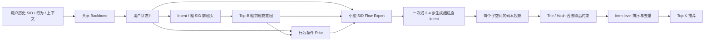

我把这里的 **SID 理解为生成式推荐中的 Semantic ID，即一个物品对应的多 token 标识**，重点调查的是：**推荐时能否并行预测同一个物品的多个 SID token，而不是逐位自回归生成。**

**调研截止日期：2026 年 9 月 23 日。** 下面按公开论文、正文中的推理流程和作者仓库来分类。需要先给出一个判断：

> **这个方向已经不只是“RPG 的多头并行”和“LLaDA-Rec 的扩散生成”两条简单路线。现有工作已经分别研究了并行友好的 SID、长 SID 压缩、离散扩散、解码调度、物品级约束、集合标识，以及串并行混合解码。**
>
> **但“并行预测”“一次模型前向”“无需 beam search”“端到端检索快”是四个不同的性质，不能混为一谈。**

---

# 一、先明确：哪些工作属于“并行生成 SID”？

设用户历史为 \(h\)，目标物品的 SID 为：

$$
c(i)=(c_1,c_2,\ldots,c_L).
$$

传统自回归生成采用：

$$
p(c(i)\mid h)
=
\prod_{\ell=1}^{L}
p(c_\ell\mid h,c_{<\ell}).
$$

你关心的方向，主要是在减少这个链条上的串行依赖。但不同论文减少依赖的位置不一样。

| 类型            | 实际并行的是什么？                   | 是否一次前向？             | 本文如何归类                  |
| ------------- | --------------------------- | ------------------- | ----------------------- |
| **一次性并行预测**   | 同一物品所有 SID 位置的分布            | 通常是一次主干前向，但仍有候选检索成本 | 最直接的核心工作                |
| **掩码／离散扩散生成** | 每轮同时预测多个未确定的位置              | 通常需要 \(T\) 轮，不必等于 1 | 核心工作                    |
| **串并行混合**     | 部分 SID 串行，部分并行；或部分网络层并行     | 仍保留部分串行过程           | 直接相关                    |
| **集合标识生成**    | 同一物品的多个语义／协同表示，或词汇 token 集合 | 可以一次前向              | 必须纳入，但要区别离散码本 SID 与连续表示 |
| **多物品／多兴趣并行** | 同时生成多个物品或多个兴趣分支             | 单个分支内部可能仍是自回归       | 相邻工作                    |
| **推测解码／系统优化** | 草稿验证、beam 状态或底层算子           | 原目标模型可能仍是自回归        | 加速相关，但不能称为非自回归 SID 生成   |

后面最重要的分类依据是：**看推理算法，不只看论文标题中有没有 “parallel”“MTP”“non-autoregressive”。**

---

# 二、核心论文总表

## 2.1 量化／编码式 SID：直接核心工作

下面这十篇，是本次检索中能够核验、应当放进这个方向核心文献集的工作。日期优先采用首次 arXiv 公开时间，不把后续修改版本算作新论文。

| 工作                       | 首次公开／arXiv              | 主要做法                                  | 推理性质                                   |
| ------------------------ | ----------------------- | ------------------------------------- | -------------------------------------- |
| **RPG**                  | 2025-06-06；`2506.05781` | OPQ 长 SID、多位置并行预测、图约束候选搜索             | **一次主干前向**，之后仍有图搜索。([arXiv][1])        |
| **DiffGRM**              | 2025-10-21；`2510.21805` | 并行语义编码、掩码离散扩散、置信度引导去噪                 | **多轮、每轮并行**。([arXiv][2])               |
| **LLaDA-Rec**            | 2025-11-09；`2511.06254` | Multi-Head VQ-VAE、双向 SID 建模、并行去噪与候选扩展 | **多轮、每轮并行**。([arXiv][3])               |
| **MaskGR／早期正文中的 MADRec** | 2025-11-28；`2511.23021` | 基于 SID 的 masked diffusion、编码器式生成      | **可调轮数的并行去噪**；这两个名称不要重复计数。([arXiv][4]) |
| **MDGR**                 | 2026-01-27；`2601.19501` | OPQ、课程式及历史感知掩码、先预热再并行                 | **先逐位置，再多位置并行**。([arXiv][5])           |
| **ACERec**               | 2026-02-14；`2602.13573` | 长 SID 的注意力压缩、意图建模、并行子空间预测             | **一次主干前向＋全物品分数聚合**。([arXiv][6])        |
| **DLMRec**               | 2026-07-23；`2607.21519` | 协同感知随机 tokenizer、扩散语言模型、课程学习与稳定性投票    | **多轮去噪／细化**。([arXiv][7])               |
| **TopoGR**               | 2026-07-28；`2607.25216` | 二进制可分解 SID、Hamming 拓扑监督、并行预测          | **并行预测＋拓扑一致性重排**。([arXiv][8])          |
| **InforID**              | 2026-08-10；`2608.09685` | 不同子空间分配不同编码容量，保留位置并行预测                | **一次性并行预测**。([arXiv][9])               |
| **EPIC**                 | 2026-09-03；`2609.03522` | 在 SID 扩散过程中引入显式物品后验约束                 | **扩散生成的增强模块**，不是独立的单步生成器。([arXiv][10]) |

其中，RPG 的作者仓库明确对应 **KDD 2025**，DiffGRM 的作者仓库明确标注 **WWW 2026**。其他论文不能仅凭 arXiv 存在，就默认已经经过同等级会议审稿。([GitHub][11])

## 2.2 扩展到集合标识和部分并行后，还必须补充这些工作

| 工作               | 时间／arXiv             | 为什么重要                             | 边界                                              |
| ---------------- | -------------------- | --------------------------------- | ----------------------------------------------- |
| **SETRec**       | 2025-02；`2502.10833` | 明确提出无序标识、协同与语义多维表示、同时生成           | **连续 token 集合**，不是 RQ／PQ 离散码本 SID。([arXiv][12]) |
| **VaLiDRec**     | 2026-07；`2607.25209` | 原生 LLM 词汇构成变长 SID，并行 token-set 预测 | **离散词汇集合 SID**，不是固定长度量化码。([arXiv][13])          |
| **GenCDSR**      | 2026-07；`2607.28659` | 跨域混合 tokenizer，粗粒度串行、细粒度并行        | 真正的 **SID 串并行混合解码**。([arXiv][14])               |
| **GR4AD／LazyAR** | 2026-02；`2602.22732` | 将部分层计算并行化，降低完整自回归解码成本             | **网络深度方向的部分并行**，上层仍自回归。([arXiv][15])            |

**因此，写 Related Work 时只列 RPG、DiffGRM、LLaDA-Rec，不够；但把 SETRec、LazyAR、OneLA 都称为同一种“并行 SID 生成”，同样不准确。**

---

# 三、路线一：一次性预测全部 SID 位置

这一类通常具有如下形式：

$$
\widehat p(c(i)\mid h)
=
\prod_{\ell=1}^{L}p_\ell(c_\ell(i)\mid h),
$$

或者使用等价的加和分数：

$$
s(i\mid h)
=
\sum_{\ell=1}^{L}\log p_\ell(c_\ell(i)\mid h).
$$

**一次前向得到所有位置的分布，再根据合法物品的 SID 组合计算候选分数。** 这里的核心问题不只是网络怎样并行，还包括：SID 是否适合分解，以及怎样从 token 分数恢复物品排名。

## 3.1 RPG：这个方向最直接的基础工作

**论文：Generating Long Semantic IDs in Parallel for Recommendation**
**arXiv：`2506.05781`**

RPG 的整体组合是：使用 **OPQ 构造较长、没有残差先后生成关系的 SID**，通过多个预测头同时输出各位置分布，再用这些分布对完整物品编码打分。它没有简单枚举所有 token 组合，而是使用 **图约束搜索**，在实际存在的物品上寻找高分候选。([arXiv][1])

它的重要性在于，把问题从“如何更快生成一条短 SID 链”改成了：

> **既然每增加一个 SID token 不必增加一次主干调用，能否使用更长、更有表达力的标识？**

但是要准确理解两件事：

**第一，RPG 的并行是预测分布的并行。** 后面的图搜索可以迭代，不过这些迭代不等于重新运行神经网络。

**第二，图搜索解决的是检索成本和合法候选问题，不自动消除位置分布相乘带来的建模限制。** 它也不能直接等同于全库精确 Top-K。([arXiv][1])

**研究定位：** 做固定长度量化 SID 的并行生成，RPG 是必须比较的起点，而不是可以略过的早期工作。

## 3.2 ACERec：并行输出之后，研究重点转向“怎样理解长 SID”

**论文：Unleash the Potential of Long Semantic IDs for Generative Recommendation**
**arXiv：`2602.13573`；当前核查到的 v2 为 2026-08-02**

ACERec 保留长 SID 和并行预测，但认为：**简单聚合一个物品的多个 token，可能损失长 SID 本来想保留的信息。** 因此加入 **Attentive Token Merger**，将多个 token 压缩为少量更有表达力的表示；再结合意图 token 和双粒度训练信号。([arXiv][6])

推理时，它并行预测各子空间分布，并对**整个合法物品库**进行向量化取值和分数聚合，而不是采用 RPG 的图搜索。论文所说的“精确检索”，指的是**精确找出其当前评分函数下的候选**，不等于评分函数已经精确恢复真实偏好。([arXiv][6])

**我的判断：** ACERec 对新工作的威胁在于，不能只把“多头输出”当成完整方案。历史 SID 如何压缩、信息是否被平均池化抹掉、最终候选如何打分，都已经有人系统处理。

## 3.3 TopoGR：不仅预测 token 类别，还利用码空间的结构

**论文：TopoGR: Revealing and Preserving Latent Structure of Semantic ID in Generative Recommendation**
**arXiv：`2607.25216`**

TopoGR 指出：tokenizer 学出的编码空间有结构，但推荐生成器往往把 token 当成互不相关的分类标签。它构造 **Bit-decomposable SID**，在输入表示、软目标监督、候选重排三个阶段引入 Hamming 邻近关系，同时采用并行 SID 预测。([arXiv][8])

**和 RPG 的区别：** RPG 主要强调长编码与并行检索；TopoGR 强调**编码之间“差一点”和“差很多”不应在学习过程中完全一样**。

**需要保留的判断边界：** Hamming 距离有明确几何意义，但它能否代表推荐相关性，要靠 tokenizer、训练目标和实验来验证，不能从“二进制编码”直接推出。

## 3.4 InforID：不同位置不必使用同样大的码本

**论文：Adaptive Semantic Capacity Allocation for Parallel Generative Recommendation**
**arXiv：`2608.09685`**

InforID 研究的是编码容量分配。传统设计经常给每个子空间相同大小的码本；它在固定总 bit 预算下，为不同子空间分配不同 bit 数：

$$
K_\ell=2^{b_\ell},
\qquad
\sum_\ell b_\ell=B.
$$

容量分配依据主要是**增加 bit 对重构误差的边际改善**，保留下来的位置仍通过并行头预测。([arXiv][9])

这里有两个容易误读的地方：它不是“根据每个用户动态选择不同 SID 长度”；也不能直接说它已经完成“面向推荐任务的端到端信息论最优分配”。

**我的判断：** 这篇让“等长、等容量、等难度”不再是默认合理的设计。但公平比较时还要注意：总 bit 数相同，\(\sum_\ell 2^{b_\ell}\) 未必相同，因此输出层参数量和计算量未必相等。

---

# 四、路线二：掩码／离散扩散，多轮并行生成 SID

这条路线从类似下面的状态出发：

$$
[\text{MASK},\text{MASK},\text{MASK},\text{MASK}]
$$

逐步得到：

$$
[c_1,\text{MASK},c_3,\text{MASK}]
\quad\longrightarrow\quad
[c_1,c_2,c_3,c_4].
$$

核心区别是：**后续预测可以利用已经确定的位置，不要求从左向右。** 但每轮预测多少、哪些位置先确定、确定后是否允许修改，是不同论文之间的重要差别。([arXiv][2])

另一个与你此前讨论有关的提醒：**这里的“扩散”是对离散 token 的加噪／掩码与去噪，不是 GRAND 那种沿图拉普拉斯演化的图扩散。** 两者可以结合，但不是同一个生成机制。([arXiv][2])

## 4.1 DiffGRM：并行编码、训练噪声和推理顺序一起设计

**论文：Diffusion-based Generative Recommendation Model**
**arXiv：`2510.21805`；WWW 2026**

DiffGRM 的主要组件包括：基于 OPQ 的 **Parallel Semantic Encoding**；根据模型当前预测状态构造更协调的掩码的 **On-policy Coherent Noising**；以及 **Confidence-guided Parallel Denoising**。历史编码和目标 SID 去噪分开组织，目标位置之间可以双向交互。([arXiv][2])

**和 RPG 的关键差别：** RPG 一次给出各位置分布；DiffGRM 允许先确定一些位置，再据此更新其他位置的预测。

**我的判断：** 它的重点不只是“把 causal mask 改成 bidirectional mask”，而是将 tokenizer、训练时的噪声分布、推理时的确定顺序联合考虑。新方法只做双向注意力，容易与它高度重叠。

## 4.2 LLaDA-Rec：专门面向 SID 的离散扩散框架

**论文：LLaDA-Rec: Discrete Diffusion for Parallel Semantic ID Generation in Generative Recommendation**
**arXiv：`2511.06254`**

LLaDA-Rec 使用 **Multi-Head VQ-VAE** 构造多位置编码，结合历史侧与目标侧的掩码学习，并以置信度决定每轮填入的位置。设 SID 长度为 \(M\)、解码轮数为 \(T\)，其并行程度与每轮确定的约 \(M/T\) 个位置相关。([arXiv][3])

有一个值得专门记住的细节：**候选扩展可以在同一次前向得到的 logits 上，逐个处理选中的位置。** 这与“每处理一个位置都重新运行模型”不同。

**我的判断：** 它是“离散扩散替代 SID 自回归”的必要基线。但不能因为名称有 LLaDA，就默认它和直接微调一个 LLaDA-8B 基础模型是同一设置；也不能把所有置信度解码都解释成“可以反复纠正已经提交的错误”。

## 4.3 MaskGR／MADRec：更一般的 SID 掩码扩散

**论文：Masked Diffusion for Generative Recommendation**
**arXiv：`2511.23021`**

该论文早期正文使用 **MADRec**，当前作者仓库为 **`snap-research/MaskGR`**，旧仓库地址会跳转。因此这是**同一篇工作，不应算成两篇**。([arXiv][4])

它采用编码器式的双向掩码建模，在 SID 序列上学习去噪，并通过不同的推理轮数权衡成本和质量。相对于强调重新设计并行 tokenizer 的方法，它允许使用不同 SID 构造方案；作者实现也直接复用 GRID 的 SID 数据处理流程。([arXiv][4])

**我的判断：** 它是验证“收益来自扩散生成，还是来自换了一个 tokenizer”的重要对照。尤其你已经用过 GRID，这条实现路线与你现有复现流程比较接近。

## 4.4 MDGR：研究“什么时候才适合并行”

**论文：Masked Diffusion Generative Recommendation**
**arXiv：`2601.19501`**

MDGR 使用 OPQ，并研究全局课程式噪声调度、历史感知的掩码难度，以及**先单位置预热、再多位置并行**的推理策略。这里的“两阶段”不是“两次前向”：预热阶段可能运行多轮。([arXiv][5])

其消融非常能说明问题：

| 设置             | 总解码轮数 | Recall@10 |   QPS |
| -------------- | ----: | --------: | ----: |
| 每轮只确定 1 个位置    |     8 |    0.2219 | 2.212 |
| 不预热，每轮确定 2 个位置 |     4 |    0.2127 | 3.015 |
| 先预热 2 轮，再并行    |     5 |    0.2199 | 2.741 |
| 先预热 4 轮，再并行    |     6 |    0.2210 | 2.527 |

这些是**同一论文、同一工业数据设置下的消融**，不是跨论文比较。减少到四轮提高了吞吐，但损失准确率；保留预热则回收了一部分效果。([arXiv][5])

**我的判断：** “所有位置从第一轮开始一起预测最好”并不是已成立的结论。解码调度本身就是研究问题。

## 4.5 DLMRec：与你的“协同信息进入 SID”方向直接相关

**论文：Diffusion Language Model for Recommendation**
**arXiv：`2607.21519`**

DLMRec 提出 **Collaborative-Aware Stochastic Tokenizer，CAST**，利用图协同表示及不同传播层的信息构造编码，再以扩散语言模型完成推荐。训练采用由物品级掩码到 token 级偏好去噪的课程，并设计稳定性相关的投票策略。其实现设置明确涉及 **LLaDA-8B-Base 和 LoRA**。([arXiv][7])

**与你的关系：** “把图协同特征注入 tokenizer，再交给扩散模型并行生成”，已经存在非常直接的工作。

**我的判断：** 后续创新必须进一步说明：你注入的协同结构是什么、为什么更适合并行预测、怎样避免冗余，以及是否改善了同等解码预算下的完整物品识别。仅增加 LightGCN 特征不够形成清晰区别。

## 4.6 EPIC：从“token 预测正确”转向“物品候选不能被错误淘汰”

**论文：EPIC: Explicit Posterior Item Conditioning for Semantic ID Diffusion Recommendation**
**arXiv：`2609.03522`**

EPIC 不是重新训练一个全新的扩散主干，而是在生成过程中维护与当前部分 SID 一致的物品候选，并估计个性化物品后验，再将其投影回尚未确定的 token 位置，指导后续去噪。([arXiv][10])

其思想可以概括为：

$$
\text{当前部分 SID}
\rightarrow
\text{仍可能的物品集合}
\rightarrow
\text{物品偏好后验}
\rightarrow
\text{下一轮 token 分布}.
$$

**关键区别：** 不是等 SID 生成完才重排，而是**在生成过程中使用物品级信息干预决策**。

**我的判断：** 这是非常重要的近期进展。它表明这个领域开始正面处理“位置概率”和“物品偏好”之间的差距。但“不增加扩散主干前向次数”，不等于候选维护和后验计算没有额外开销。

---

# 五、路线三：不再把标识当成有序量化链——集合式并行

这条路线容易被只检索 “parallel semantic ID” 的调研漏掉，但与你要做的方向很接近。

## 5.1 SETRec：比 RPG 更早讨论“无序标识＋同时生成”

**论文：Order-agnostic Identifier for Large Language Model-based Generative Recommendation**
**arXiv：`2502.10833`；SIGIR 2025**

SETRec 把物品表示成一组**连续的协同 token 和语义 token**，通过可学习 query 同时生成不同维度的表示，并用特殊稀疏注意力避免人为引入物品内部的 token 顺序。生成的表示集合再通过物品表示库完成匹配。([arXiv][12])

**这里必须准确区分：**

> SETRec 确实研究同一物品的多 token 同时生成，但原文明说使用连续 token，而非离散量化 token。

所以它不是 RPG 式 PQ-SID 的同类实现，却是“多维标识不应强制串行”“语义与协同分开表达”的重要先行工作。

**对创新性的影响：** “协同一个头、语义几个头，然后一起预测”的大框架，不能当作全新思想。

## 5.2 VaLiDRec：变长、原生词汇 SID 的并行集合预测

**论文：VaLiDRec: Variable-Length LLM-Aligned Semantic IDs for Generative Recommendation**
**arXiv：`2607.25209`**

VaLiDRec 不使用 RQ／PQ 人工码本，而是从物品文本中选择有信息量的 **LLM 原生词汇 token**，通过剪枝及碰撞处理构造变长 SID。推荐模型结合图结构软提示，一次预测相关 token 的分数，再对各物品的 token 集合聚合打分。([arXiv][13])

它的物品分数使用长度归一化的 token 概率聚合，而不是固定位置的自回归概率链；全词汇分数由一次前向得到，但全库聚合依然需要计算。([arXiv][13])

**我的判断：** 这篇说明“并行 SID”不一定意味着“PQ＋多个分类头”。原生词汇、变长集合、token-level 与 item-level 联合监督，已经形成另一条明确路线。

此外，**存储标识的唯一性不等于模型能个性化区分碰撞物品**。例如一个消歧后缀不参与预测和语义评分时，就必须另外检查碰撞物品如何排序。([arXiv][13])

---

# 六、路线四：保留部分依赖，不追求彻底非自回归

## 6.1 GenCDSR：粗粒度先确定，细粒度再并行

**论文：Empowering Cross-Domain Sequential Recommendation with Hybrid Tokenization and Serial-Parallel Decoding**
**arXiv：`2607.28659`；RecSys 2026**

GenCDSR 面向跨域序列推荐，通过混合 tokenizer 同时建模跨域共享与域特有信息，再采用串并行混合解码。具体实现不能简单理解成“每个粗粒度 token 都跑一遍大模型”：它利用主干前向产生隐状态，先由较小预测头串行确定前段编码，再借助下一次主干计算并行预测后段。([arXiv][14])

**意义：** 层级 SID 不一定必须全部自回归，也不一定必须全部并行。可以把串行预算留给影响较大的部分。

## 6.2 GR4AD／LazyAR：把串行成本限制在部分网络层

**论文：Generative Recommendation for Large-Scale Advertising**
**arXiv：`2602.22732`**

LazyAR 将底部一部分网络层的未来位置计算提前并行完成，并在 beam 之间复用；上部网络层仍保留自回归依赖，同时加入多 token 预测辅助训练。([arXiv][15])

**意义：** 并行化可以沿“网络深度”进行，而不只沿“SID 位置”进行。

**分类上要明确：** 它减少了串行计算量，但不是所有 SID 位置完全独立的一次性输出模型。

---

# 七、哪些相关工作必须知道，但不能错算成同一类？

## 7.1 推测解码与系统加速

| 工作                                                                                                                  | 论文标识         | 实际做什么                          | 为什么不是完全并行 SID 生成                          |
| ------------------------------------------------------------------------------------------------------------------- | ------------ | ------------------------------ | ----------------------------------------- |
| **AtSpeed** — *Efficient Inference for Large Language Model-based Generative Recommendation*                        | `2410.05165` | 针对推荐 Top-K 的草稿与验证，包含严格和放宽的接受机制 | 目标生成模型仍是自回归。([arXiv][16])                 |
| **SpecGR** — *Inductive Generative Recommendation via Retrieval-based Speculation*                                  | `2410.02939` | 检索器提出物品草稿，生成模型验证，并支持新物品        | 并行的是候选提出／验证，不等于独立预测 SID 各位置。([arXiv][17]) |
| **NEZHA** — *A Zero-sacrifice and Hyperspeed Decoding Architecture for Generative Recommendations*                  | `2511.18793` | 大主干配合轻量自草稿头、合法物品 hash 验证       | 草稿头本身仍有 token 自回归。([arXiv][18])           |
| **PAD-Rec** — *Position-Aware Drafting for Inference Acceleration in LLM-Based Generative List-Wise Recommendation* | `2604.27747` | 利用位置差异改进推测草稿                   | 改进的是推测解码，不是去掉目标模型的自回归结构。([arXiv][19])     |
| **OneLA** — *Scaling Linear-Attention Decoding to Large Beams in Generative Recommendation*                         | `2609.12399` | 共享状态、beam 分支表示和 GPU 实现优化       | 优化自回归 beam 解码的系统成本。([arXiv][20])          |

特别是 NEZHA，论文中的“zero-sacrifice”不应被直接转述成“严格保持某个原始模型完整输出分布”的数学保证。推荐指标上的不损失、合法物品验证、严格分布等价，是不同概念。([arXiv][18])

## 7.2 多分支、列表或多物品并行

| 工作                                                                                                                     | 标识           | 与本问题的关系                                         |
| ---------------------------------------------------------------------------------------------------------------------- | ------------ | ----------------------------------------------- |
| **BARGE** — *Bridging the Structural Gap: Adapting Autoregressive Generation for Recommendation*                       | `2607.21028` | 两个解码通道并行，但各通道内部仍有 RQ 层级的自回归链。([arXiv][21])      |
| **GPR** — *Towards a Generative Pre-trained One-Model Paradigm for Large-Scale Advertising Recommendation*             | `2511.10138` | 多兴趣／多预测分支，不代表每个 SID 内部全部非自回归。([arXiv][22])      |
| **OGR** — *Once Generated, Ranked: End-to-End Generative Slate Recommendation with Unified Semantic-Collaborative IDs* | `2608.17613` | 列表规划和不同物品解码可流水重叠，但单物品 SID 仍有自回归依赖。([arXiv][23]) |
| **FANS** — *Fast Non-Autoregressive Sequence Generation for Item List Continuation*                                    | `2304.00545` | 非自回归地预测多个后续物品，不是专门研究一个物品的多位量化 SID。([arXiv][24]) |
| **NAR4Rec** — *Non-autoregressive Generative Models for Reranking Recommendation*                                      | `2402.06871` | 非自回归重排给定候选列表，不等于从全库并行生成 SID。([arXiv][25])       |

这些工作可以作为效率、列表建模或多兴趣建模的相关文献，但不应拿来充当“一步生成完整 SID”的直接证据。

## 7.3 用了 SID，却绕开 SID 生成的工作

**TokenRec — Learning to Tokenize ID for LLM-based Generative Recommendations，`2406.10450`。**

它确实使用多路量化 tokenizer 编码协同信息，也确实避开自回归解码；但在线输出主要是**连续偏好／物品表示，再进行向量检索**，并非预测目标物品全部离散 SID token。([arXiv][26])

**DiGR — From Token Generation to Item Ranking: Direct Generative Recommendation with Semantic IDs，`2602.07847`，当前核查版本为 2026-08-16。**

它保留 SID 作为组合式物品表示，但直接学习物品级评分，不再把 SID token 当作在线逐位生成目标。它还分析了位置边缘分布与完整物品排序之间的信息差距。([arXiv][27])

**这两类模型是重要对照：新方法必须解释，为什么“并行生成 token 再检索”比“保留 SID 表示、直接物品打分”更值得做。**

---

# 八、这些论文共同解决了什么，又留下了什么？

## 8.1 第一层问题：生成慢——已经有多种答案

一次性多头、离散扩散、部分串行、轻量草稿和系统优化，都在减少原本完整 SID 自回归链的成本。因此，**“把 SID 改成并行生成”本身已经不是足够独立的创新点**。RPG、DiffGRM、LLaDA-Rec 和 LazyAR 分别覆盖了其中不同做法。([arXiv][1])

## 8.2 第二层问题：各位置预测得好，不等于完整物品排得好

这是我认为最重要的理论问题。

考虑四个物品，SID 分别是：

$$
00,\quad 01,\quad 10,\quad 11.
$$

某用户的真实偏好为：

$$
p(00)=0.5,\qquad p(11)=0.5,
$$

另两个物品概率为零。两个位置分别看，都是：

$$
p(c_1=0)=p(c_1=1)=0.5,
$$

$$
p(c_2=0)=p(c_2=1)=0.5.
$$

如果独立相乘，四个物品都会得到 \(0.25\)。结果是：**每个位置的边缘概率都预测正确，完整物品排序仍然错误。**

这个例子说明：

$$
\boxed{
\text{token 边缘分布正确}
\;\not\Rightarrow\;
\text{物品联合偏好正确}
}
$$

DiGR 的分析也针对这种“位置级信息是否足以恢复物品排名”的问题；EPIC 则从算法上引入物品后验来干预扩散。需要注意，这不是说任意 SID 编码、任意数据分布下一定失败，而是说**不能普遍保证恢复完整排序**。([arXiv][27])

## 8.3 第三层问题：PQ 的子空间分开，不代表用户偏好独立

“编码器把向量拆成多个子空间”和“用户对这些属性的联合偏好可以分解”是两件事。

例如，价格和品类可以分别编码，但一个用户可能喜欢“便宜零食”和“高端电脑”，不喜欢“高端零食”和“便宜电脑”。**表示上的分解不能自动消除偏好中的交互。**

所以，RPG、InforID 等并行友好 tokenizer 的设计解决了部分表示与计算问题，却不能仅凭结构就证明位置独立假设在推荐上成立。([arXiv][1])

## 8.4 第四层问题：扩散能逐步利用上下文，但不免费

扩散模型后续轮次可以利用已确定位置，这是它相对于一次性独立预测的优势来源之一。但同一轮内仍可能同时提交不一致的位置；过早提交也可能淘汰正确物品。

MDGR 的预热策略、DiffGRM 的置信度调度、EPIC 的候选后验，实际上分别针对这一问题的不同侧面。**“使用扩散”不是问题已经解决，而是提供了一个可以逐步修正决策的框架。**([arXiv][5])

## 8.5 第五层问题：合法性、唯一性、排序正确性是三个指标

生成结果能对应某个物品，不代表这个物品符合用户偏好；标识没有碰撞，也不代表模型学会区分了这些物品。

因此至少应分开评估：

$$
\text{合法 SID 比例}
,\qquad
\text{物品区分能力}
,\qquad
\text{推荐排序质量}.
$$

RPG 的图约束、VaLiDRec 的标识消歧、EPIC 的物品后验分别涉及其中不同问题，不能把它们的作用直接等同。([arXiv][1])

---

# 九、怎样判断这些方法谁更强？不能直接拼论文中的提升百分比

**目前不适合根据各论文自报的提升百分比，排出一个统一的“并行 SID SOTA 榜”。** 这里混杂了不同 tokenizer、不同 LLM、不同任务设置、不同物品库规模和不同解码预算。

尤其是一次性模型和扩散模型，应当统一以下比较条件：

| 比较维度    | 必须控制或报告的内容                                |
| ------- | ----------------------------------------- |
| **SID** | 构造方法、长度、码本大小、碰撞处理、是否有协同特征                 |
| **主干**  | 参数量、预训练来源、历史截断长度、输入 token 数               |
| **推理**  | 主干前向次数、每轮确定位置数、beam／候选数、是否重排或投票           |
| **检索**  | 全库打分还是近似检索，是否计算图搜索、候选维护与后验成本              |
| **效率**  | 同硬件、同 batch 下的端到端延迟、吞吐和内存，而不只是 decoder 时间 |
| **效果**  | 全库 Recall／NDCG、长尾／冷启动表现、有效候选率、多随机种子结果     |

一个特别值得补读的近期研究是：

**What Makes a Good Semantic ID for Generative Recommendation? A Reproducibility Study，`2609.24430`，2026-09-21。**

它在统一设置下发现：不同 SID 设计的收益并非单调；码本更均衡、SID 更长、主干更大，都不保证推荐更好。它不是并行生成方法，但对解释这类实验至关重要。([arXiv][28])

**对你的实验而言，最有价值的不是只证明“我比 TIGER 好”，而是证明：同一 SID、同一主干、同一端到端预算下，你的并行机制仍然更好。**

---

# 十、结合你的研究方向：哪些创新表述已经很危险？

你之前关注的是“在 SID 训练时注入协同信息”。放到并行生成方向，下面这些表述都已经有直接重叠：

| 拟宣称的创新                    | 已经覆盖它的重要工作                      |
| ------------------------- | ------------------------------- |
| “用 PQ／OPQ 替代残差码，并行预测全部位置” | RPG、DiffGRM、MDGR                |
| “去掉从左到右顺序，双向预测 SID”       | DiffGRM、LLaDA-Rec、MaskGR        |
| “按置信度决定先生成哪些位置”           | DiffGRM、LLaDA-Rec、MDGR          |
| “先生成关键 token，再并行补全”       | MDGR、GenCDSR                    |
| “融合图协同信息和并行标识”            | DLMRec；集合表示方面还有 SETRec、VaLiDRec |
| “让码空间几何参与生成学习”            | TopoGR                          |
| “不同位置分配不同编码容量”            | InforID                         |
| “用物品级偏好约束扩散生成”            | EPIC                            |

这些重叠对应的具体机制，已在前文的原文核查中展开。**真正值得继续研究的，不是再简单组合一次这些组件，而是明确一个它们尚未被充分证明解决的目标。**

我认为对你最有价值的三个问题是：

**第一，什么样的协同 SID 真正适合少轮并行预测？**
不仅看重构误差或语义邻近，还要测量：在给定用户历史后，各位置剩余依赖有多强，完整物品是否容易被区分，以及一轮、两轮、四轮分别能达到什么质量。

**第二，怎样同时保留联合偏好和并行效率？**
独立头容易丢失组合关系，多轮扩散会增加成本。值得研究的是，在固定计算预算下，哪些依赖必须显式建模，哪些可以省略，而不是把所有位置一律独立或一律串行。

**第三，tokenizer 与解码规则是否真正共同优化？**
用于自回归的“好前缀”，未必是用于并行补全的“好位置”；用于向量重构的“好码”，也未必是用于物品排序的“好标识”。需要把“编码适合什么推理过程”作为实验对象，而非默认前提。

这三个是**值得验证的研究问题**，不是未经进一步查重和实验就能宣称的空白或 SOTA 方法。

---

# 十一、代码与复现入口

以下仓库在本次核查时能够访问。**仓库存在不等于所有数据、权重和实验配置均已齐全。**

| 工作            | 作者仓库                           | 核查备注                                                              |
| ------------- | ------------------------------ | ----------------------------------------------------------------- |
| **RPG**       | `facebookresearch/RPG_KDD2025` | 官方实现，适合作为一次性并行路线起点。([GitHub][11])                                 |
| **DiffGRM**   | `liuzhao09/DiffGRM`            | 官方实现；README 明确说明未分发 checkpoints、准备好的数据及 OPQ／SID 缓存。([GitHub][29]) |
| **LLaDA-Rec** | `TengShi-RUC/LLaDA-Rec`        | 作者仓库可访问。([GitHub][30])                                            |
| **MaskGR**    | `snap-research/MaskGR`         | 包含训练／推理代码；SID 构造衔接 GRID。([GitHub][31])                            |
| **DLMRec**    | `ChengyiLIU-cs/DLMRec`         | 当前 README 标注为 temporary GitHub；有 GNN、量化等目录，文档较简略。([GitHub][32])   |

还有一篇应放入待补全文清单：

**Long Semantic IDs for Generative Recommendation，LSIG，WWW 2026，DOI `10.1145/3774904.3792834`。**

本次检索能够确认论文记录及其与长 SID、层级多 token 预测有关，但没有成功获取足够的原文推理细节。因此，**不能仅凭“MTP”就把它计入已经确认的一步并行推理模型**。这也是本次调研明确保留的证据缺口。([ACM Digital Library][33])

---

# 最终结论

**按你最关心的“同一物品的多位离散量化 SID 并行生成”，核心阅读集应该是：**

**RPG、ACERec、TopoGR、InforID；DiffGRM、LLaDA-Rec、MaskGR、MDGR、DLMRec；以及物品级扩散增强 EPIC。**

**扩展到完整技术脉络，还必须加入 SETRec、VaLiDRec、GenCDSR、LazyAR，并用 TokenRec／DiGR 区分“生成 SID”与“使用 SID 直接检索”。**

我对整个方向的判断是：

> **第一阶段的问题是“怎样不再逐位生成 SID”，这一点已经有很多答案。现在更有研究价值的问题是：在减少串行依赖以后，怎样仍然保留完整物品的联合偏好、候选一致性和排序质量。**
>
> **对于你要做的协同 SID，最值得证明的不是“协同特征让编码更好”，而是“这些协同编码为什么能让少轮并行生成更准确，并且在相同端到端计算预算下优于现有方案”。**

[1]: https://arxiv.org/html/2506.05781v1 "https://arxiv.org/html/2506.05781v1"
[2]: https://arxiv.org/html/2510.21805v1 "https://arxiv.org/html/2510.21805v1"
[3]: https://arxiv.org/html/2511.06254v1 "https://arxiv.org/html/2511.06254v1"
[4]: https://arxiv.org/html/2511.23021v1 "https://arxiv.org/html/2511.23021v1"
[5]: https://arxiv.org/html/2601.19501v2 "https://arxiv.org/html/2601.19501v2"
[6]: https://arxiv.org/html/2602.13573v2 "https://arxiv.org/html/2602.13573v2"
[7]: https://arxiv.org/html/2607.21519v1 "https://arxiv.org/html/2607.21519v1"
[8]: https://arxiv.org/html/2607.25216v1 "https://arxiv.org/html/2607.25216v1"
[9]: https://arxiv.org/html/2608.09685v1 "https://arxiv.org/html/2608.09685v1"
[10]: https://arxiv.org/html/2609.03522v1 "https://arxiv.org/html/2609.03522v1"
[11]: https://github.com/facebookresearch/RPG_KDD2025 "https://github.com/facebookresearch/RPG_KDD2025"
[12]: https://arxiv.org/html/2502.10833v1 "https://arxiv.org/html/2502.10833v1"
[13]: https://arxiv.org/html/2607.25209v1 "https://arxiv.org/html/2607.25209v1"
[14]: https://arxiv.org/html/2607.28659v1 "https://arxiv.org/html/2607.28659v1"
[15]: https://arxiv.org/html/2602.22732v1 "https://arxiv.org/html/2602.22732v1"
[16]: https://arxiv.org/abs/2410.05165 "https://arxiv.org/abs/2410.05165"
[17]: https://arxiv.org/abs/2410.02939 "https://arxiv.org/abs/2410.02939"
[18]: https://arxiv.org/html/2511.18793v1 "https://arxiv.org/html/2511.18793v1"
[19]: https://arxiv.org/abs/2604.27747 "https://arxiv.org/abs/2604.27747"
[20]: https://arxiv.org/abs/2609.12399 "https://arxiv.org/abs/2609.12399"
[21]: https://arxiv.org/html/2607.21028v1 "https://arxiv.org/html/2607.21028v1"
[22]: https://arxiv.org/html/2511.10138v1 "https://arxiv.org/html/2511.10138v1"
[23]: https://arxiv.org/html/2608.17613v1 "https://arxiv.org/html/2608.17613v1"
[24]: https://arxiv.org/html/2304.00545v1 "https://arxiv.org/html/2304.00545v1"
[25]: https://arxiv.org/abs/2402.06871 "https://arxiv.org/abs/2402.06871"
[26]: https://arxiv.org/html/2406.10450v1 "https://arxiv.org/html/2406.10450v1"
[27]: https://arxiv.org/html/2602.07847v2 "https://arxiv.org/html/2602.07847v2"
[28]: https://arxiv.org/abs/2609.24430 "https://arxiv.org/abs/2609.24430"
[29]: https://github.com/liuzhao09/DiffGRM "https://github.com/liuzhao09/DiffGRM"
[30]: https://github.com/TengShi-RUC/LLaDA-Rec "https://github.com/TengShi-RUC/LLaDA-Rec"
[31]: https://github.com/snap-research/MADRec "https://github.com/snap-research/MADRec"
[32]: https://github.com/ChengyiLIU-cs/DLMRec "https://github.com/ChengyiLIU-cs/DLMRec"
[33]: https://dl.acm.org/doi/10.1145/3774904.3792834 "https://dl.acm.org/doi/10.1145/3774904.3792834"

---

# 十二、对 2504.16054v1（π0.5）的深度拆解

本节是在前面 SID 并行生成调研基础上的新增分析。论文是 **π0.5: a Vision-Language-Action Model with Open-World Generalization**，本地 PDF 为 [`2504.16054v1.pdf`](./2504.16054v1.pdf)，公开页面为 [arXiv:2504.16054](https://arxiv.org/abs/2504.16054)。它本身不是推荐论文，也没有讨论 Semantic ID；值得借鉴的是它如何把一个长链路决策任务拆成“高层语义决策”和“低层连续输出”，并让两者共享主干、使用不同专家。

## 12.1 π0.5 真正做了什么

π0.5 的联合分布被写成：

$$
\pi_\theta(a_{t:t+H},\hat \ell\mid o_t,\ell)
=
\pi_\theta(a_{t:t+H}\mid o_t,\hat \ell)
\pi_\theta(\hat \ell\mid o_t,\ell).
$$

其中：

- (o_t) 是图像和机器人状态；
- (ell) 是高层任务，例如“整理卧室”；
- (hat\ell) 是模型输出的语义子任务，例如“捡起枕头”；
- (a_{t:t+H}) 是连续动作块，而不是单个动作；
- 推理时先生成 (hat\ell)，再以 (hat\ell) 为条件生成一整个动作块。

这形成了一个清楚的分工：

> **大模型负责理解场景、任务和下一步语义；小型 action expert 负责在该语义条件下并行产生低层连续动作。**

论文的实现有几个细节对推荐尤其有启发：

1. **预训练阶段全部使用离散 token。** 机器人动作被 FAST tokenizer 离散化，和网页问答、图像定位、文本任务一起使用标准 next-token loss 训练。这样做的好处是训练稳定、容易混合异构数据。
2. **后训练阶段再增加 action expert。** action expert 约 300M 参数，而视觉语言主干约 2B 参数；它负责 flow matching 的连续动作输出。论文不是从一开始就让一个模型同时承受离散 token loss 和 flow loss。
3. **动作不是逐步输出，而是一次输出一个长度为 50 的 action chunk。** 论文中 (H=49)，即 50 个动作位置；flow matching 输入带噪动作块，action expert 输出向量场。
4. **主干和 expert 之间使用单向信息流。** 图像、任务、状态形成 prefix；action expert 可以看 prefix 和自己的 token，但 VLM token 不看 action expert，FAST token 与 action expert 也相互隔离，防止两种动作表示发生信息泄漏。
5. **π0.5 并非一步 flow 推理。** 论文默认使用 10 个 denoising/integration steps。它证明的是“用一个小型连续 expert 生成动作块”，不是已经证明了推荐场景下的一步生成。
6. **数据混合是能力来源的一部分。** 训练包含移动机器人、非移动机器人、跨 embodiment 数据、高层子任务预测、网页多模态数据和人工 verbal instruction。约 400 小时移动机器人数据只是直接相关数据的一部分；论文强调跨来源迁移带来的泛化。
7. **高层标签本身有效，但训练数据比运行时强制分层更重要。** 显式 high-level inference 最好；不在运行时显式生成高层子任务、但训练时保留 high-level 数据的 implicit-HL 变体通常是第二好；完全移除 high-level 数据会明显下降。

## 12.2 π0.5 的实验结论中最值得迁移的部分

| π0.5 结论 | 对生成式推荐的可迁移含义 |
|---|---|
| 高层语义子任务帮助长时程任务 | 先预测用户当前的粗粒度兴趣／SID 前缀，再生成细粒度 SID 后缀 |
| 离散预训练比一开始训练 flow 更稳定 | 先用 TIGER/RPG 式离散 SID 目标训练，再增加 flow SID expert |
| 小 expert 能完成低层连续输出 | 不必让整个 LLM 参与每个 SID 后缀位置的解码，可以增加小型并行 expert |
| prefix 到 expert 是单向的 | backbone 产出用户状态，SID expert 读取状态；expert 的噪声或预测结果不回流污染 backbone |
| 异构数据提升泛化 | 将 next-item、masked SID、属性预测、文本对齐、跨域行为和冷启动物品放进统一训练配方 |
| 显式高层推理有收益，但 implicit-HL 也有收益 | 即使最终为了延迟不生成自然语言 intent，也要用粗粒度 intent／prefix 监督训练主干 |
| 10 步 flow 可以实时控制，但还不是单步 | 推荐中要额外做 rectified-flow／consistency distillation 和单步 ranking alignment，才能争取 1–2 步 |

## 12.3 不能直接照搬的部分

机器人动作是连续向量，动作块中的 50 个位置有明确的时间顺序；SID 是离散码，必须满足码本、层级和物品合法性约束。直接把动作 expert 换成一个连续向量头，会有三个问题：

1. 连续输出最近的码字组合可能不是目录中的合法物品；
2. 对各码位分别取最近码字会破坏码位之间的联合偏好；
3. 只做向量重构会得到语义上接近的物品，却不一定得到用户真正会点击的物品。

所以推荐侧必须在 π0.5 的 expert 之外加入 **码本投影、合法物品约束和 item-level ranking loss**。这也是本方案相对“把 FlowRec 或连续扩散接在 TIGER 后面”的关键区别。

---

# 十三、最终建议的研究方案：HiFlow-SID

## 13.1 一句话定义

暂定方法名为 **HiFlow-SID（Hierarchical Intent-conditioned Flow Semantic-ID Generation）**，中文可称为“**分层意图条件流式 Semantic ID 生成**”：

> **用一个共享 backbone 从用户历史中提取状态，用一个很短的粗粒度 intent／SID prefix 表达当前兴趣，再用一个小型 flow expert 在一次或少数几次前向中并行产生 SID 的细粒度后缀，最后通过码本和 Trie／hash 约束还原成合法物品。**

它借鉴 π0.5 的核心结构，但把：

- high-level subtask 换成推荐中的 **粗粒度用户意图／SID 前缀**；
- action chunk 换成 **细粒度 SID 后缀的联合表示**；
- action expert 换成 **SID flow expert**；
- 机器人动作合法性换成 **合法物品集合约束和 item-level ranking**。

这个方向不再宣称“第一次做并行 SID”。已有工作已经覆盖一次性多头、离散扩散和串并行解码。更准确的研究问题是：

> **在保持 Semantic ID 的冷启动泛化和共享语义结构的同时，能否用一个行为条件的、小型、可蒸馏为一步的 flow expert，替代细粒度 SID 的长自回归链，并保持完整物品的联合偏好和合法性？**

## 13.2 总体结构



推荐的默认形态是：

- (g)：一个粗粒度 intent token，或 SID 的第一个／前两个 prefix code；
- (c_{2:L})：剩余细粒度 SID；
- (h=B(H))：共享 backbone 输出的用户状态；
- (E_\phi)：只负责细粒度 SID 的小型 flow expert；
- (S=1) 为默认推理步数，(S=2) 或 (S=4) 是低置信度 fallback。

## 13.3 SID tokenizer 应如何设计

这里建议分成“能快速验证的 v1”和“论文完整版本 v2”，不要一开始同时重做 tokenizer、backbone 和推理器。

### v1：复用现有 TIGER/RQ-VAE SID

假设现有物品 SID 为：

$$
(c_1,c_2,c_3,c_4).
$$

先将 (c_1) 作为粗粒度 prefix，(c_2,c_3,c_4) 作为细粒度 suffix。优点是可以直接和 TIGER 做同 tokenizer、同 backbone 的公平实验；缺点是 RQ-VAE 的后续 residual code 仍有较强层级依赖，可能限制完全并行的上限。

### v2：分层但并行友好的 grouped SID

将物品表示拆成两部分：

$$
\text{SID}(i)=[g_i; r_i],
$$

其中：

- (g_i) 是 1–2 个共享粗码，编码品类、主题、内容和跨域共性；
- (r_i=(r_{i,1},\ldots,r_{i,M})) 是多个独立或弱依赖的细粒度码，使用 Multi-Head VQ、OPQ 或 parallel residual codebook；
- 训练时仍保留重构损失和 item-level 对比损失，避免仅为并行而牺牲语义表达力。

这一步不是简单照搬 RPG。需要增加一个 **parallelizability-aware tokenizer objective**，直接测量并优化：

$$
\text{SuffixDependence}
=I(r_{i,m};r_{i,<m}\mid H,g_i),
$$

或者用可估计的条件互信息／残差预测增益近似它。目标不是让所有码位完全独立，而是让**真正需要串行的依赖集中在 prefix，细粒度 suffix 在给定 (g) 和 (h) 后尽可能适合并行预测**。

### v2 中协同信息的注入方式

你此前关注协同信息进入 SID，建议采用三路输入，但不要只把 LightGCN 向量拼接到文本向量后面：

$$
 x_i=\operatorname{Fuse}(x_i^{\text{text}},x_i^{\text{visual}},x_i^{\text{collab}}).
$$

更有研究价值的做法是：

- 粗码 (g_i) 主要吸收跨物品可迁移的语义与协同共性；
- suffix 码吸收细粒度内容和局部协同差异；
- 对同一用户历史训练一个 **joint suffix discriminator**，约束 tokenizer 产生的 suffix 对用户可区分，而不仅仅能重构物品 embedding。

这样可以直接回答“为什么协同 SID 更适合少轮并行生成”，而不是只证明“加入协同特征后离线 NDCG 变高”。

## 13.4 两阶段训练

### 阶段 A：离散语义预训练

先不使用 flow expert，沿用稳定的离散训练配方。建议目标为：

$$
\mathcal L_{\text{pre}}
=\lambda_{\text{full}}\mathcal L_{\text{full-SID}}
+\lambda_{\text{coarse}}\mathcal L_{\text{intent/prefix}}
+\lambda_{\text{mtp}}\mathcal L_{\text{suffix-MTP}}
+\lambda_{\text{mask}}\mathcal L_{\text{masked-SID}}
+\lambda_{\text{align}}\mathcal L_{\text{item-align}}.
$$

各项含义：

- (mathcal L_{\text{full-SID}})：原始 TIGER 式完整 SID 目标，保留高质量教师路径；
- (mathcal L_{\text{intent/prefix}})：预测 (g) 或粗 SID prefix；
- (mathcal L_{\text{suffix-MTP}})：给定 (h,g) 并行预测所有 suffix 码位；
- (mathcal L_{\text{masked-SID}})：随机 mask 历史 SID 或目标 SID，增强双向上下文建模；
- (mathcal L_{\text{item-align}})：生成表示与物品内容／协同表示的对比学习。

训练数据可以混合：

1. 用户历史到 next-item SID；
2. SID 到物品文本、类别和属性；
3. masked SID reconstruction；
4. 跨域行为序列；
5. 长尾和冷启动物品的内容输入；
6. 同一粗意图下的正负物品区分。

这一阶段对应 π0.5 的“heterogeneous co-training”与离散 FAST 预训练，但将推荐侧任务全部改成可自动构造的监督，不需要人工标注高层子任务。

### 阶段 B：增加 SID flow expert

对目标物品 (i)，定义细粒度 SID 的码本 embedding 拼接为：

$$
 z_1(i)=
[E_2[c_2(i)];E_3[c_3(i)];\ldots;E_L[c_L(i)]].
$$

由用户历史和粗意图产生行为条件 prior：

$$
 z_0=P_\psi(h,g)+\sigma\epsilon,
\qquad \epsilon\sim\mathcal N(0,I).
$$

这里的 prior 不直接从无信息的高斯噪声开始，而是借鉴 FlowRec 的 behavior-guided prior：它已经包含用户当前偏好，因此更适合少步流动到目标物品。

采样 (t\sim U(0,1))，构造直线路径：

$$
 z_t=(1-t)z_0+t z_1.
$$

SID flow expert (v_\phi) 回归向量场：

$$
\mathcal L_{\text{FM}}
=\mathbb E\left[
\left\|
 v_\phi(z_t,t,h,g)-(z_1-z_0)
\right\|_2^2
\right].
$$

在 (t=0) 做一步 Euler 推理：

$$
\hat z_1^{(1)}=z_0+v_\phi(z_0,0,h,g).
$$

为了使这一步真正具有 item ranking 能力，加入从中间状态直接得到终点的对比对齐：

$$
\tilde z_1=z_t+(1-t)v_\phi(z_t,t,h,g),
$$

$$
\mathcal L_{\text{rank}}
=-\log
\frac{\exp(\operatorname{sim}(\tilde z_1,z_1^+)/\tau)}
{\exp(\operatorname{sim}(\tilde z_1,z_1^+)/\tau)
+\sum_{j\in\mathcal N}
\exp(\operatorname{sim}(\tilde z_1,z_1^j)/\tau)}.
$$

这一步借鉴 FlowRec 的 single-step alignment，但正样本和负样本都使用细粒度 SID 表示，而不是直接绕开 SID 做全库 item embedding ranking。

为了将 8–10 步教师流蒸馏到一步，增加：

$$
\mathcal L_{\text{distill}}
=\left\|
\hat z_1^{(1)}-\operatorname{stopgrad}(\hat z_1^{(S_{teacher})})
\right\|_2^2,
$$

其中 (S_{teacher}\in\{8,10\})，学生模型默认只运行 1 步；低置信度请求可以运行 2 或 4 步。

最终后训练目标为：

$$
\mathcal L_{\text{post}}
=
\alpha\mathcal L_{\text{FM}}
+\beta\mathcal L_{\text{rank}}
+\gamma\mathcal L_{\text{distill}}
+\eta\mathcal L_{\text{code}}
+\lambda\mathcal L_{\text{KD}}.
$$

其中：

- (mathcal L_{\text{code}})：将 (hat z_{1,m}) 投影到第 (m) 个码本，要求真实 codeword 概率高；
- (mathcal L_{\text{KD}})：蒸馏原始 TIGER 的完整 SID 条件概率，避免速度提升来自明显的分布退化；
- Trie/hash 约束放在离散候选生成阶段，不把不可微 Trie 强行塞进 flow loss。

## 13.5 推理流程：一步为主，少步和自回归为保险

给定用户历史 (H)：

```text
1. 共享 backbone 只运行一次，得到用户状态 h。
2. 粗意图头输出 Top-B 个 g 或 SID prefix。
3. 将 B 个 prefix 复制成一个 batch，送入小型 SID flow expert。
4. 默认做 1 次 Euler；低置信度分支做 2 次 Heun 或 4 次 Euler。
5. 对每个 suffix 位置并行计算与码本的相似度 / logits。
6. 用 prefix Trie、完整 SID hash 和可用性过滤非法组合。
7. 按 item score 排序、去重，返回 Top-K。
```

对分支 (b) 下的物品 (i)，建议分数为：

$$
S(i\mid H)
=
\log p(g_b\mid h)
+\sum_{m=2}^{L}\log p(c_m(i)\mid\hat z_{1,m},h,g_b)
+\lambda_r s_{\text{rank}}(i,h)
+\lambda_c s_{\text{content}}(i,h).
$$

其中：

- 第一项保留粗粒度 intent 的置信度；
- 第二项利用并行 expert 生成的细粒度码；
- 第三项防止 token 边缘概率正确但完整 item 排名错误；
- 第四项帮助冷启动和长尾物品。

**候选生成不要只保留一个粗 prefix。** 建议 (B=8\sim32)，并行处理多个 prefix；否则粗意图一次错判会把正确物品整个排除。

如果出现以下情况，触发 fallback：

- 合法物品数量低于阈值；
- suffix 码位平均置信度低；
- 一步结果与 coarse prefix 的语义相似度过低；
- 去重后候选不足 Top-K。

fallback 顺序建议为：

$$
1\text{-step flow}
\rightarrow
2\text{-step flow}
\rightarrow
4\text{-step flow}
\rightarrow
小 beam 的 suffix 自回归。
$$

这样可以把计算预算集中给困难请求，避免所有请求都承担多轮扩散或 beam search 的成本。

## 13.6 为什么它比现有并行路线更有区分度

| 方法 | 它已经解决的部分 | HiFlow-SID 需要明确增加的部分 |
|---|---|---|
| RPG | 长 SID、一次多头预测、图约束 | 行为条件 flow prior；粗意图条件；联合 suffix 依赖；一步蒸馏和 ranking alignment |
| DiffGRM / LLaDA-Rec / MaskGR | 双向建模、mask denoising、逐轮修正 | 默认 1–2 步连续 flow；不把每次修正都交给扩散轮次；使用 SID codebook 和 item ranking |
| MDGR | 预热后并行的解码调度 | 将需要串行的部分显式定义为 intent/prefix，把 suffix 交给小 expert |
| GenCDSR | 两阶段 SID、粗串行细并行 | 后段不是 AR head，而是可蒸馏的 flow expert；行为 prior 与 ranking loss |
| ACERec | 长 SID 压缩、并行子空间评分 | 仍是生成式候选产生；通过 flow 生成 item-specific suffix，而不是只对全库打分 |
| NEZHA | 自草稿和 hash 合法性验证 | 细粒度 suffix 本身不再串行 draft；flow 输出后直接做合法 SID 解码 |
| FlowRec | behavior prior、straight flow、single-step alignment | 不绕过 SID；输出的是可约束的细粒度 SID latent 和合法物品 |
| π0.5 | 离散预训练 + 小型连续 expert + 高低层分解 | 将 semantic subtask/action chunk 具体化为 intent/prefix 与 SID suffix |

需要诚实说明：**如果实现只是“RPG 加一个 flow head”，创新性仍然偏弱。** 真正应该围绕以下可验证属性组织论文：

1. 在相同 SID、相同 backbone 和相同端到端预算下，一步模型是否保持完整物品排序；
2. behavior-guided prior 是否比 Gaussian prior 更适合 SID 少步生成；
3. coarse prefix 的串行预算是否能够显著降低 suffix 的联合依赖；
4. flow expert 是否比 MTP 在同样一次前向下更少产生无效／冲突 SID；
5. tokenizer 的 parallelizability 指标能否预测所需推理轮数。

---

# 十四、复杂度和预期收益

设完整 SID 长度为 (L)，beam size 为 (K_b)，共享 backbone 一次前向成本为 (C_B)，小型 flow expert 一次成本为 (C_E)，且 (C_E\ll C_B)。

TIGER 的主要成本近似为：

$$
T_{\text{TIGER}}
\approx K_b L C_B+T_{\text{beam/trie}}.
$$

HiFlow-SID 的主要成本近似为：

$$
T_{\text{HiFlow}}
\approx C_B+B S C_E+T_{\text{codebook/trie/item-rank}}.
$$

其中 (B) 是粗 prefix 分支数，(S\in\{1,2,4\}) 是 flow 步数。若 backbone 只做一次 prefill，多个 (g) 在 expert batch 中并行，那么串行深度从 (K_bL) 降到 (1+S)；细粒度 SID 长度增加时，主干调用次数不再线性增加。

这里不应提前承诺某个固定倍数。合理的研究目标是：

- 1-step：端到端 P50/P95 延迟显著低于 TIGER beam search；
- 2-step：质量接近完整模型，同时保持明显吞吐优势；
- 4-step：作为困难样本 fallback，恢复大部分质量；
- 合法 SID 比例、去重后有效候选数和 cold-start NDCG 不因加速明显下降。

最终报告必须把 **主干前向、flow expert、码本投影、Trie/hash、候选后验和排序** 全部计入端到端延迟，不能只报告模型 decoder 时间。

---

# 十五、实验设计

## 15.1 公平基线

建议最少包含：

1. TIGER：原始 RQ-VAE + AR + beam search；
2. TIGER + KV cache：工程优化基线；
3. RPG：一次多位置预测；
4. LLaDA-Rec 或 DiffGRM：离散扩散，报告 1/2/4/8 步；
5. GenCDSR 风格：粗段串行、细段 MTP 并行；
6. NEZHA：自草稿 + hash 验证；
7. ACERec：长 SID 压缩和并行 item scoring；
8. FlowRec／DiGR：连续 flow 或直接 item-level ranking 对照，说明“生成 SID”和“使用 SID 做 item scoring”的差别。

## 15.2 自身消融

| 变体 | 目的 |
|---|---|
| Full AR SID | 质量上限与串行延迟 |
| MTP suffix | 验证并行头本身的收益 |
| MTP + coarse prefix | 验证高低层分解是否有帮助 |
| Flow expert + Gaussian prior | 与 behavior prior 对照 |
| Flow expert + behavior prior | 验证 π0.5/FlowRec 的 prior 迁移 |
| Flow expert 无 ranking alignment | 验证 item-level 联合偏好作用 |
| 1/2/4/8 step | 质量—延迟曲线 |
| 无 Trie/hash | 量化非法 SID 和碰撞影响 |
| RQ SID vs parallel/grouped SID | tokenizer 与并行解码的匹配关系 |
| 无蒸馏／有蒸馏 | 验证一步模型的可行性 |
| 单 prefix vs Top-B prefix | 量化粗意图误杀问题 |

## 15.3 指标

质量指标：

- Recall@1/5/10；
- NDCG@5/10；
- MRR；
- full-catalog ranking 和固定候选 ranking 分开报告；
- 长尾、冷启动、跨域和不同历史长度切片。

生成与合法性指标：

- valid SID ratio；
- item collision／duplicate ratio；
- 去重后候选数；
- coarse prefix accuracy；
- suffix code accuracy；
- 完整 item exact match；
- token 分数与 item-level ranking 的 Spearman/Kendall 相关性。

系统指标：

- 主干 forward 次数；
- flow expert forward 次数；
- P50/P95/P99 端到端延迟；
- QPS 和 GPU memory；
- batch=1、在线小 batch、离线大 batch 分开测试；
- 候选约束、码本投影和后验排序耗时。

推荐的目标表达方式是“质量—延迟 Pareto 曲线”，不要只给一个平均加速比。可以将目标写成：

> 在同一 SID tokenizer、同一 backbone、同一硬件和同一候选规模下，HiFlow-SID 的 1–2 步配置达到接近 TIGER 的完整物品排序质量，并显著降低 P50/P95 延迟；在困难样本上，2–4 步或小 beam fallback 恢复质量。

这里的“接近”在实验前可定义为 NDCG@10 相对下降不超过 1–3 个百分点，作为工程目标而不是已经得到的结果。

## 15.4 推荐的最小可行实现顺序

**MVP-1：不改 tokenizer。**

- 复用现有 TIGER RQ-VAE SID；
- 第一个 SID code 作为 coarse prefix；
- suffix 加 MTP head；
- 加 Trie/hash 和 item-level rerank；
- 先确认串行深度、有效率和延迟确实下降。

**MVP-2：加入 flow expert。**

- suffix code embedding 拼接为 (z_1)；
- 用行为状态构造 (z_0)；
- 训练 FM + ranking alignment；
- 比较 1/2/4/8 步和 Gaussian prior。

**MVP-3：做一步蒸馏和困难样本 fallback。**

- 8–10 步教师流蒸馏到 1 步；
- 用置信度决定 2/4 步；
- 比较统一 1 步与 adaptive-step 的 Pareto 曲线。

**MVP-4：再重新学习 parallel-friendly tokenizer。**

- grouped RQ／Multi-Head VQ／OPQ 三种 tokenizer；
- 测量 suffix conditional dependence；
- 验证 tokenizer 的并行性是否能预测 HiFlow-SID 的最终质量。

---

# 十六、主要风险和备选方案

## 风险 1：一步 flow 输出的码位组合不合法

**原因：** 连续 latent 的各分量最近码字组合不一定对应真实物品。

**处理：** prefix Trie、完整 SID hash、Top-B coarse branch、codebook logits、候选不足时触发 2/4 步或小 beam fallback。合法性必须作为独立指标报告。

## 风险 2：token 边缘概率不错，但完整物品排序差

**原因：** 并行头把位置边缘分布相乘，忽略码位联合关系。

**处理：** flow expert 输出完整 suffix latent；加入 item-level contrastive/ranking loss；使用候选物品级 rerank；报告 token ranking 与 item ranking 的相关性。

## 风险 3：粗 prefix 错误导致正确物品永远进不来

**处理：** 不使用单一 greedy prefix；保留 Top-B prefix，并允许软 prefix mixture；对低置信度 coarse 结果使用全局 content/dense fallback。

## 风险 4：RQ-VAE 的 residual 依赖阻碍 suffix 并行

**处理：** v1 只作为兼容性验证；v2 比较 Multi-Head VQ、OPQ 和 grouped residual；报告给定 (h,g) 后的条件依赖，而不是只看重构误差。

## 风险 5：flow expert 学成平均物品，模式坍缩

**处理：** behavior prior、多个低差异 noise seed、in-batch hard negatives、item-level InfoNCE、KD 到 TIGER teacher、长尾重采样。

## 风险 6：全库后验或 Trie 计算抵消模型加速

**处理：** 使用粗 prefix 分桶、子树候选缓存、整数 hash 编码、GPU vectorized gather；端到端统计所有后处理成本；必要时使用 ANN 只生成候选，再做精确合法性检查。

## 风险 7：与已有论文组合过近

**处理：** 论文贡献不要写成“并行 SID”“flow recommendation”或“粗到细解码”。应聚焦：

1. 行为条件的 SID suffix flow prior；
2. 一步蒸馏下的合法 SID 生成；
3. 粗 prefix 串行预算与 suffix 联合偏好的分工；
4. tokenizer parallelizability 与少步推理质量的关系；
5. 同 tokenizer、同 backbone、同端到端预算的严格比较。

---

# 十七、建议的论文式贡献表述

如果实验能够支持，贡献可以写成下面三点，语气应保持克制：

1. **Hierarchical semantic planning for SID generation.** 将 SID 分成 intent/prefix 和 fine-grained suffix，明确把有限串行预算用于高影响的粗语义决策，将细节生成交给并行 expert。
2. **Behavior-conditioned flow expert for semantic IDs.** 借鉴 π0.5 的小型 action expert，并结合推荐中的 behavior-guided prior，在 SID code embedding 空间学习从用户状态到完整细粒度码的 flow；配合 item-level alignment，减少独立 token 预测的联合偏好损失。
3. **One/few-step valid decoding with adaptive fallback.** 通过教师流蒸馏、codebook projection、Trie/hash 约束和置信度路由，实现默认一步、困难样本少步或小 beam 的推荐解码，并用端到端 Pareto 实验验证质量与延迟。

不要写成“首次使用 flow matching 加速生成式推荐”或“首次并行生成 Semantic ID”，因为现有 FlowCF、FlowRec、RPG、DiffGRM、LLaDA-Rec、GenCDSR 等已经覆盖了这些表述的不同部分。

## 可直接使用的摘要草稿

> 现有 Semantic-ID 生成式推荐模型通常通过自回归方式逐位生成物品标识，虽然能够利用共享语义码本，但 beam search 带来的串行延迟限制了长 SID 和实时部署。我们提出 HiFlow-SID，一种分层意图条件的少步 Semantic-ID 生成框架。模型首先由共享序列 backbone 从用户历史中提取行为状态，并预测目标物品的粗粒度语义前缀；随后，一个轻量 SID flow expert 以该状态和前缀为条件，在细粒度码本 embedding 空间中并行生成完整 suffix。我们使用行为条件 prior、flow matching、item-level ranking alignment 和教师流蒸馏，使模型能够以一步 Euler 推理作为默认路径，并在低置信度请求上自适应增加少量步数。最后通过 codebook projection 与 Trie/hash 约束将连续输出还原为合法物品。实验将在相同 tokenizer、backbone、候选规模和硬件下比较 TIGER、RPG、离散扩散、串并行解码、NEZHA 和连续 flow 基线，重点评估完整物品排序、合法 SID 比例、冷启动效果以及 P50/P95 端到端延迟。

---

# 十八、补充参考文献

- [π0.5: a Vision-Language-Action Model with Open-World Generalization](https://arxiv.org/abs/2504.16054)；本地版本：[`2504.16054v1.pdf`](./2504.16054v1.pdf)。
- [Recommender Systems with Generative Retrieval（TIGER）](https://arxiv.org/abs/2305.05065)。
- [Generating Long Semantic IDs in Parallel for Recommendation（RPG）](https://arxiv.org/abs/2506.05781)。
- [DiffGRM: Diffusion-based Generative Recommendation Model](https://arxiv.org/abs/2510.21805)。
- [LLaDA-Rec: Discrete Diffusion for Parallel Semantic ID Generation](https://arxiv.org/abs/2511.06254)。
- [NEZHA: A Zero-sacrifice and Hyperspeed Decoding Architecture](https://arxiv.org/abs/2511.18793)。
- [Unleash the Potential of Long Semantic IDs（ACERec）](https://arxiv.org/abs/2602.13573)。
- [Empowering Cross-Domain Sequential Recommendation with Hybrid Tokenization and Serial-Parallel Decoding（GenCDSR）](https://arxiv.org/abs/2607.28659)。
- [Flow Matching for Collaborative Filtering（FlowCF）](https://arxiv.org/abs/2502.07303)。
- [Flow Matching based Sequential Recommender Model（FMRec）](https://arxiv.org/abs/2505.16298)。
- [FlowRec: Prior-Informed Flow Matching for Efficient Sequential Recommendation Generation](https://arxiv.org/abs/2508.17618)。
- [Better & Faster Large Language Models via Multi-token Prediction](https://arxiv.org/abs/2404.19737)。
- [From Token Generation to Item Ranking: Direct Generative Recommendation with Semantic IDs（DiGR）](https://arxiv.org/abs/2602.07847)。

---

# 十九、收敛后的具体 Idea：HiFlow-SID-OneStep

前面的 HiFlow-SID 是总体方向。为了形成可以直接实现、实验和投稿的单一方法，建议把它收敛为：

> **HiFlow-SID-OneStep：基于粗语义前缀和行为条件 Flow Expert 的一步 Semantic-ID 生成。**

它只解决一个明确问题：

> 在保留 TIGER 的 Semantic ID 语义共享、长尾泛化和生成式检索形式的同时，把完整 SID 的大部分串行解码替换成一次小型 expert 前向，并且通过联合物品能量和 Trie 约束避免并行 token 预测造成的物品不一致。

## 19.1 具体模型定义

先使用现有 TIGER 的四位 SID 作为第一版实验对象：

$$
\operatorname{SID}(i)=(c_1,c_2,c_3,c_4).
$$

把第一位 \(c_1\) 定义为粗语义前缀，把后三位定义为细粒度 suffix：

$$
g_i=c_1(i),\qquad r_i=(c_2(i),c_3(i),c_4(i)).
$$

给定用户历史 \(H\)，模型执行以下计算：

1. 共享 backbone 编码历史，得到 \(h=B_\theta(H)\)；
2. 粗粒度头预测 \(p(g\mid h)\)，保留 Top-\(B\) 个 prefix；
3. 行为条件 prior 根据 \(h\) 和 \(g\) 产生 suffix 初始状态 \(z_0\in\mathbb R^{3\times d}\)；
4. 小型 Flow Expert 一次性输出三个位点的向量场；
5. 通过一次 Euler 更新得到三个 suffix latent；
6. 将 suffix latent 投影到三个码本，结合 prefix Trie 生成合法 SID；
7. 用联合物品能量对合法候选重新排序。

形式化写成：

$$
h=B_\theta(H),
$$

$$
g\sim p_\theta(g\mid h),
$$

$$
z_0=P_\psi(h,g)+\sigma_\psi(h,g)\odot\epsilon,
\qquad \epsilon\sim\mathcal N(0,I),
$$

$$
\hat z_1=z_0+v_\phi(z_0,0,h,g).
$$

其中 \(v_\phi\) 是小型 Flow Expert。它不是为每个 suffix 位置单独使用一个完全独立的 MLP，而是使用一个只有 2–4 层的轻量 Transformer，在三个 suffix 位置之间做 self-attention。因此三个位置的输出是联合产生的，仍然可以表达 \(c_2,c_3,c_4\) 之间的关系。

每个位置的 codebook logits 为：

$$
q_m(k)=
\frac{\operatorname{sim}(\hat z_{1,m},E_m[k])}{\tau},
\qquad m\in\{2,3,4\}.
$$

最终候选不由三个位置的独立 argmax 决定，而是在合法 Trie 中搜索：

$$
\hat i=
\arg\max_{i\in\mathcal I(g)}
\left[
\log p(g_i\mid h)
+\sum_{m=2}^4 q_m(c_m(i))
+\lambda E_\omega(h,g_i,\operatorname{SID}(i))
\right].
$$

\(E_\omega\) 是联合物品能量头，输入完整 SID 和用户状态，用来纠正“每个 code 位置都预测得不错，但组合出来的物品不对”的问题。这是方法里非常关键的一点：

> **并行 flow 负责快速产生候选，联合能量负责恢复完整物品的偏好关系，Trie 负责保证候选合法。**

## 19.2 训练方式

训练分为两步，保证 flow expert 不会破坏原有 TIGER 能力。

### 第一步：离散 teacher training

共享 backbone 先使用完整 SID 训练：

$$
\mathcal L_{\text{teacher}}
=
\mathcal L_{\text{AR-full}}
+\lambda_g\mathcal L_{\text{prefix}}
+\lambda_m\mathcal L_{\text{suffix-MTP}}
+\lambda_a\mathcal L_{\text{item-align}}.
$$

其中：

- \(\mathcal L_{\text{AR-full}}\)：原始 TIGER 式完整 SID teacher-forcing loss；
- \(\mathcal L_{\text{prefix}}\)：预测第一位粗语义 prefix；
- \(\mathcal L_{\text{suffix-MTP}}\)：给定真实 prefix 后，同时预测后三位 suffix；
- \(\mathcal L_{\text{item-align}}\)：SID 表示和文本／协同物品表示的对齐损失。

这一阶段的作用是让 backbone 学会用户行为和 SID 语义，且给 flow expert 提供一个强 teacher。

### 第二步：训练 Flow Expert 和联合能量头

将真实 suffix code 的 embedding 拼接为 \(z_1\)：

$$
z_1(i)=
[E_2[c_2(i)];E_3[c_3(i)];E_4[c_4(i)]].
$$

训练时采样 \(t\sim U(0,1)\)：

$$
z_t=(1-t)z_0+t z_1.
$$

Flow matching loss：

$$
\mathcal L_{\text{FM}}
=
\mathbb E
\left\|
v_\phi(z_t,t,h,g)-(z_1-z_0)
\right\|_2^2.
$$

一步预测的 code loss：

$$
\mathcal L_{\text{code}}
=
-\sum_{m=2}^{4}
\log p_\phi(c_m(i)\mid \hat z_{1,m},h,g).
$$

联合物品能量使用 in-batch negatives：

$$
\mathcal L_{\text{joint}}
=
-\log
\frac{\exp(E_\omega(h,g_i,\operatorname{SID}(i))/\tau)}
{\sum_{j\in\{i\}\cup\mathcal N}
\exp(E_\omega(h,g_j,\operatorname{SID}(j))/\tau)}.
$$

再加入原始 TIGER 的知识蒸馏：

$$
\mathcal L_{\text{KD}}
=
\sum_{m=1}^{4}
\operatorname{KL}
\left(
p_{\text{TIGER}}(c_m\mid H,c_{<m})
\,\Vert\,
p_{\text{HiFlow}}(c_m\mid H)
\right).
$$

最终损失为：

$$
\mathcal L
=
\alpha\mathcal L_{\text{FM}}
+\beta\mathcal L_{\text{code}}
+\gamma\mathcal L_{\text{joint}}
+\delta\mathcal L_{\text{KD}}.
$$

为了让一步推理稳定，可以先训练一个 8 或 10 步 flow teacher，再蒸馏到一步：

$$
\mathcal L_{\text{1-step}}
=
\left\|
z_0+v_\phi(z_0,0,h,g)
-\operatorname{stopgrad}(z_1^{(8\text{-step})})
\right\|_2^2.
$$

因此最终线上只需要一步，训练时仍然可以利用多步 teacher 的质量。

## 19.3 一次推理的伪代码

~~~text
Input: user history H, valid SID trie T, codebooks E2/E3/E4

1. h = Backbone(H)                                      # 1 次大模型前向
2. prefix_pool = TopB(PrefixHead(h))                     # B 个粗 prefix
3. for g in prefix_pool in parallel:
4.     z0 = Prior(h, g)
5.     z1 = z0 + FlowExpert(z0, t=0, h, g)               # 1 次小 expert 前向
6.     q2, q3, q4 = CodebookProject(z1, E2, E3, E4)
7.     candidates_g = TrieTopK(T, g, q2, q3, q4)
8.     for item in candidates_g:
9.         score(item) = prefix_score + suffix_score
10.                      + JointEnergy(h, g, SID(item))
11. merge candidates from all g, deduplicate
12. return TopK by score
~~~

低置信度请求采用自适应路径：

~~~text
1-step flow
  -> 合法候选不足或平均置信度低
2-step Heun flow
  -> 仍然不足
4-step flow
  -> 仍然不足
small suffix beam fallback
~~~

默认请求保持一步，困难请求增加计算。这样可以报告真实的质量—延迟 Pareto 曲线，而不是让所有请求都使用最慢的解码策略。

# 二十、为什么这个方法比已有生成式推荐加速方法更有优势

这里的“更好”需要限定为：**在同一 SID tokenizer、同一 backbone、同一硬件、同一候选规模下，比较端到端延迟和完整物品排序。** 它不是对所有数据集、所有规模都保证绝对优于已有方法。

## 20.1 相比 TIGER：减少大模型串行调用，同时保留 Semantic ID

TIGER 的完整 SID 逐位自回归生成，且 beam search 会进一步放大调用次数：

$$
T_{\text{TIGER}}
\approx K_bL\cdot C_{\text{backbone}}.
$$

HiFlow-SID-OneStep 只需要：

$$
T_{\text{HiFlow}}
\approx C_{\text{backbone}}
+B\cdot C_{\text{flow-expert}}
+T_{\text{Trie}}.
$$

因此：

- 大模型只编码一次用户历史；
- suffix 长度从 3 增加到 8、16 时，不再线性增加大模型调用；
- 仍然生成合法 Semantic ID，保留共享码本、冷启动泛化和生成式检索的解释性。

目标不是把 TIGER 的质量换成纯速度，而是用 teacher 和 joint energy 尽量保留完整 item ranking。

## 20.2 相比 RPG：避免完全独立的多 token 假设

RPG 的优势是一次性并行预测长 SID，但它主要依赖各位置的并行分布和图约束。它的核心风险是：

$$
\text{token marginal correctness}
\not\Rightarrow
\text{complete item ranking correctness}.
$$

HiFlow-SID-OneStep 有三层补偿：

1. coarse prefix 显式保留最重要的层级依赖；
2. Flow Expert 在 suffix 位置之间使用 self-attention，联合生成 suffix latent；
3. Joint Energy 对完整物品重新评分，而不是只累加独立位置 logits。

因此，HiFlow-SID 的假设比 RPG 更弱：只有 suffix 在给定 \(h,g\) 后适合并行，而不是假设所有 SID 位点完全独立。

## 20.3 相比 LLaDA-Rec、DiffGRM、MaskGR：把多轮去噪压缩成一步

离散扩散可以通过多轮 mask、重预测和置信度调度修正错误，但每一轮都需要一次主干或扩散模型前向。质量和延迟之间存在直接权衡：

$$
T_{\text{diffusion}}
\approx S\cdot C_{\text{diffusion}}.
$$

HiFlow-SID-OneStep 的差异是：

- 用行为条件 prior 代替无信息的全 mask／高斯起点；
- 用直线路径 flow matching 学习从用户兴趣到目标 suffix 的方向；
- 用 8–10 步 teacher 蒸馏到 1 步 student；
- 只在低置信度请求上增加步骤。

所以它的目标不是在每次推理中迭代修正，而是让初始状态已经接近用户偏好，再用一步完成主要迁移。

## 20.4 相比 GenCDSR：后段不是自回归 head，而是小型联合 expert

GenCDSR 的串并行方法已经证明“粗段串行、细段并行”有效，但细粒度阶段仍主要由并行分类头完成，并保留一定的主干重算和位置条件依赖。

HiFlow-SID-OneStep 的区别是：

- 只让 prefix 消耗层级决策预算；
- suffix 全部由小型 Flow Expert 处理；
- expert 的 hidden state 在 suffix 位置之间做联合建模；
- 共享 backbone 不因每个 suffix 位置再次调用。

理想情况下推理深度是：

$$
1\text{ 次 backbone prefill}+1\text{ 次小 expert}.
$$

## 20.5 相比 NEZHA／Speculative Decoding：不再依赖串行草稿

NEZHA 把草稿头放入主模型，并使用 hash set 验证合法 ID；它可以降低延迟，但草稿头仍然按 SID 位置推进，核心过程仍是自回归 draft。

HiFlow-SID-OneStep 的优势是：

- 不需要逐位生成 draft；
- 不需要目标模型逐位验证 draft；
- hash／Trie 只负责合法性过滤，不负责承担主要语义推理；
- suffix 的一次输出天然适合 batch 和 GPU 并行。

NEZHA 对原始自回归分布更忠实；这需要通过 TIGER KD 和 ranking 实验验证。

## 20.6 相比 ACERec／DiGR：保留生成式候选产生

ACERec 和 DiGR 通过压缩 SID 或直接建模 item-level score 获得并行效率，但更接近并行计算候选物品分数，目录很大时仍包含全库分数聚合和排序成本。

HiFlow-SID-OneStep 先由 prefix 将目录分到较小语义子树，再只在相关 Trie 子树中生成和排序候选：

$$
O(B\cdot M+|\mathcal I(g)|),
\qquad |\mathcal I(g)|\ll|\mathcal I|.
$$

所以它保留 Semantic ID 的生成式召回路径，而不是退回到全量 item scoring。小目录场景下 ACERec／DiGR 可能更快，实验必须把这种情况报告出来。

## 20.7 相比 FlowRec／FlowCF：保留离散 SID 的合法性

FlowRec 和 FlowCF 的 flow 终点主要是连续物品表示，最后依赖向量相似度或全库排序。

HiFlow-SID-OneStep 将 flow 作用在 SID suffix code embedding 上：

- 输出可以直接投影到离散 codebook；
- 结果可以通过 Trie/hash 映射到合法物品；
- coarse prefix 保留层级语义；
- 文本和协同语义可以通过 SID 共享给长尾和冷启动物品。

因此可以借鉴 FlowRec 的 behavior prior 和 single-step alignment，但仍然解决 Semantic-ID 生成任务。

# 二十一、最核心的可验证假设

**H1：给定用户状态和粗 prefix 后，suffix 的条件依赖显著下降。**

测量：

$$
I(c_m;c_{<m}\mid H)
\quad\text{和}\quad
I(c_m;c_{<m}\mid H,g).
$$

**H2：行为条件 prior 比 Gaussian 或全 mask 起点更适合一步生成。**

固定 flow expert 和一步预算，只替换 prior，比较完整 item NDCG、valid ratio 和 code exact match。

**H3：Joint Energy 能弥补并行 code logits 对完整物品联合关系的损失。**

比较 suffix logits、suffix logits + Trie、suffix logits + Joint Energy + Trie。

**H4：一步模型的错误可以通过置信度路由集中到少量困难请求。**

报告不同请求比例下的平均步数、P95 延迟和 NDCG，而不是只报告统一 1-step 或统一 4-step。

# 二十二、最小实验和预期目标

第一版不要重新设计全部 tokenizer。建议使用 Amazon Beauty、Sports、Toys 和 Yelp，固定现有 TIGER RQ-VAE SID，固定同一个 T5／LLM backbone，比较：

| 方法 | 主干调用 | 细粒度生成 | 合法性处理 | 研究问题 |
|---|---:|---|---|---|
| TIGER beam | 多次 | 完整 AR | Trie | 质量与延迟上限 |
| RPG/MTP | 1 次 | 独立并行 | 图／Trie | 独立 token 的损失 |
| LLaDA/DiffGRM | 4/8 次 | 多轮 mask | 扩散候选 | 多轮修正收益 |
| GenCDSR 风格 | 2 次或多阶段 | 粗串行、细并行 | Trie | 串并行基线 |
| HiFlow-1 | 1+1 次 | suffix flow 一步 | Joint Energy + Trie | 核心方法 |
| HiFlow-2/4 | 1+2/4 次 | suffix flow 少步 | Joint Energy + Trie | 质量恢复能力 |
| HiFlow adaptive | 平均少于 2 步 | 置信度路由 | Joint Energy + Trie | 线上折中 |

建议把目标写成：

- HiFlow-1 的完整 item NDCG@10 达到 TIGER 的 97%–99% 区间；
- HiFlow-1 的 P50 延迟达到 TIGER beam 的 3–8 倍改善；
- HiFlow-adaptive 只对 10%–30% 的困难请求增加额外 flow 步骤；
- valid SID ratio 高于纯 MTP；
- cold-start／长尾 NDCG 不低于 TIGER 和 RPG；
- 在同等端到端延迟下，优于 RPG 的 NDCG；
- 在同等 NDCG 下，少于离散扩散的平均前向次数。

这些是实验目标，不是已有结果；论文中应明确标注为 target。

最终建议使用的论文题目是：

> **HiFlow-SID-OneStep: Intent-Conditioned One-Step Flow Decoding for Semantic-ID Generative Recommendation**

